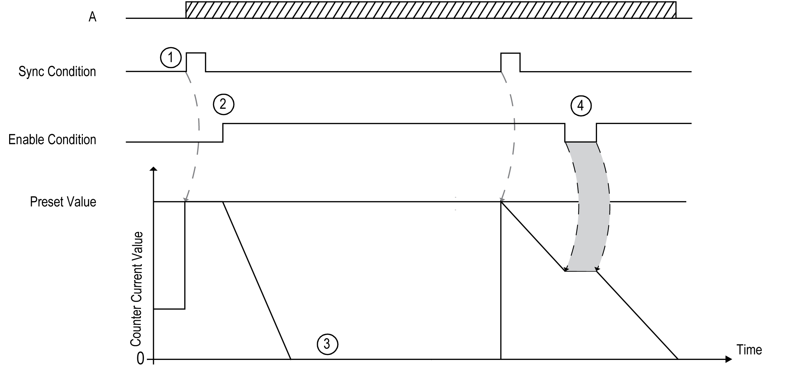

# Principle Diagram

Principle Diagram

This table explains the stages from the preceding graphic:

| Stage | Action |
| --- | --- |
| 1 | On the rising edge of the Sync condition, the preset value is loaded in the counter (regardless of the current value) and the counter value is set. |
| 2 | When Enable condition = TRUE, the current counter value decrements on each pulse on input A until it reaches 0. |
| 3 | The counter waits until the next rising edge of the Sync condition.  Note: At this point, pulses on input A have no effect on the counter. |
| 4 | When Enable condition = FALSE, the counter ignores the pulses from input A and retains its current value until the Enable condition again = TRUE. The counter resumes counting pulses from input A on the rising edge of the Enable input from the held value. |

NOTE: Enable and Sync conditions depends on configuration. These are described in the [Enable](../Synchronization,_Enable,_Reset_to_Zero,_Homing/Synchronization_Enable_Reset_to_Zero_Homing-3.htm#XREF_D_SE_0006709_1) and [Synchronization](../Synchronization,_Enable,_Reset_to_Zero,_Homing/Synchronization_Enable_Reset_to_Zero_Homing-2.htm#XREF_D_SE_0006708_1) function.