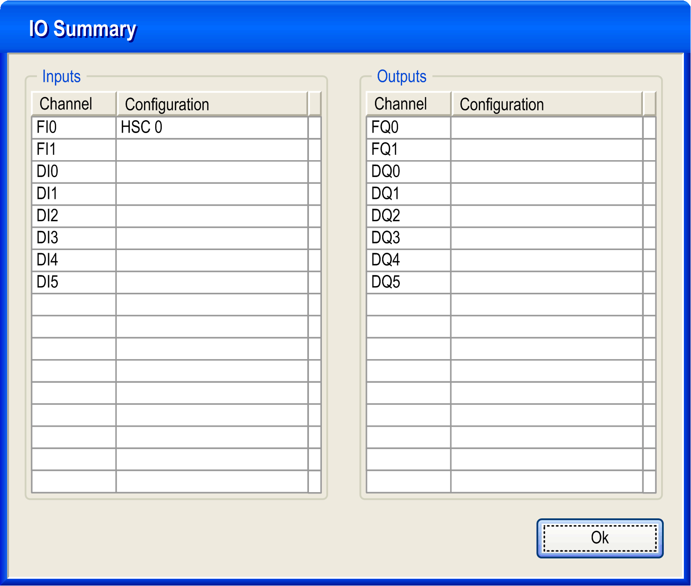

# IO Summary

IO Summary

 Click the IO Summarize... button to display the input and output assignments.

NOTE: Any physical I/O conflicts (for example, the same input or output pin shared by two different functions) will be highlighted in red in the IO Summary.

[Refer to the hardware guide for wiring details](../../../../../../api/crossBook?lang=en-US&virtualBookName=SCUhw&topicID=D_SE_0024581_1).