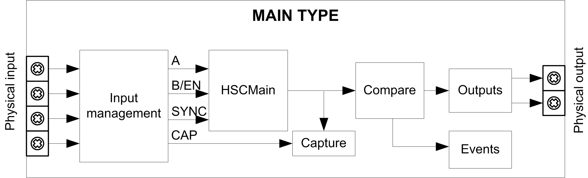

# Synopsis Diagram

Synopsis Diagram

This diagram provides an overview of the Main type in Modulo-loop mode:

A and B are the counting inputs of the counter.

EN is the enable input of the counter.

CAP is the capture input of the counter.

SYNC is the synchronization input of the counter.