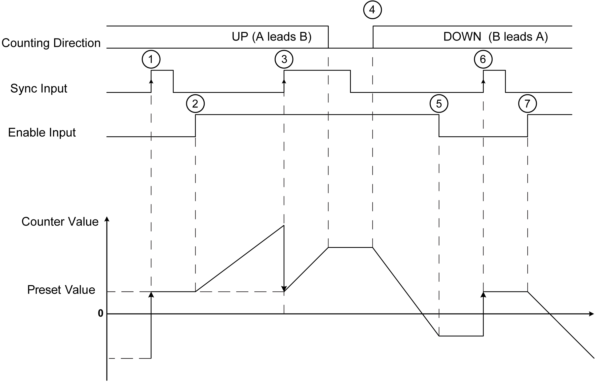

# Quadrature Principle Diagram

Quadrature Principle Diagram

The encoder signal is counted according to the input mode selected, as shown below:

The figures shows the affect of the inputs on the counter value for Normal Quadrature:

| Stage | Action |
| --- | --- |
| 1 | On the rising edge of Sync input, the current value is set to the configured preset value. |
| 2 | When Enable condition = TRUE, each pulse pair with leading edge on A increments the counter value. |
| 3 | On the rising edge of Preset condition, the current value is set to the configured preset value. |
| 4 | When Enable condition = TRUE, each pulse pair with leading edge on B decrements the counter value. |
| 5 | When Enable condition = FALSE, the all further pulses are ignored. |
| 6 | On the rising edge of Sync input, the current value is set to the configured preset value. |
| 7 | When Enable condition = TRUE, the pulse pair with leading edge on B decrements the counter value. |