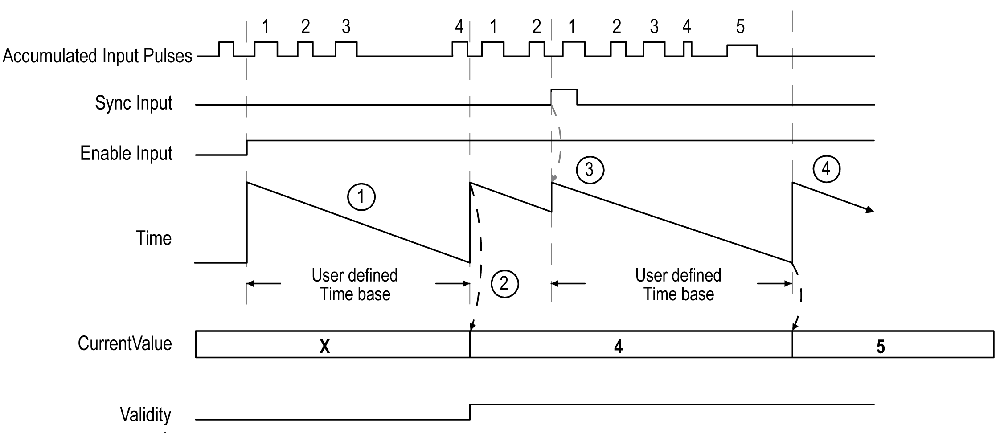

# Principle Diagram

Principle Diagram

| Stage | Action |
| --- | --- |
| 1 | When Enable condition = TRUE, the counter accumulates the number of events (pulses) on the physical input during a predefined period of time.  If Validity = 0, the current value is not used. |
| 2 | Once the first period of time has elapsed, the counter value is set to the number of events counted over the period and Validity is set to TRUE.  The counting restarts for a new period of time. |
| 3 | On the rising edge of the Sync condition:  othe accumulated input pulse value is reset to 0  othe current value is not updated  othe counting restarts for a new period of time |
| 4 | Once the period of time has elapsed, the counter value is set to the number of events counted over the period.  The counting restarts for a new period of time. |

NOTE:

On the Main type, when the Enable condition is:

oSet to FALSE: the current counting is aborted and CurrentValue is maintained to the previous valid value.

oSet to TRUE: the accumulated value is reset to 0, the CurrentValue remains unchanged, and the counting restarts for a new period of time.