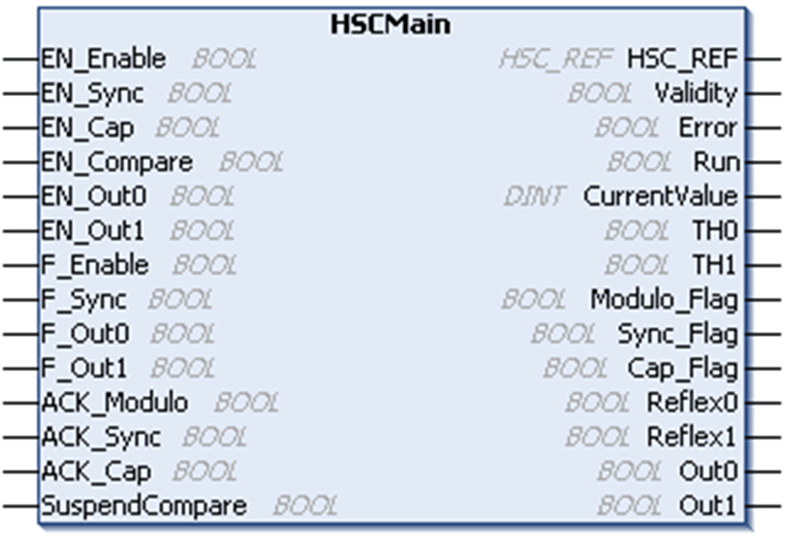

# Adding a HSCMain Function Block

Adding a HSCMain Function Block

| Step | Description |
| --- | --- |
| 1 | Drag the Libraries > Controller > HMISCU > HMISCU\_HSC > HSCMain FB to the Application tree > HMISCUxx5 > POU and drop it on the Start Here box in the lower window. |
| 2 | The instance name is located in the Variable field at the Device tree > HMISCU••5 > Embedded Functions > HSC > HSC0• with the HSC0• > Type that is set to Main.  Using the input assistant, the HSC instance can be selected at the following path: Embedded Functions > HSC |
| NOTE: This method is for ST, LD, or FBD languages. | |

