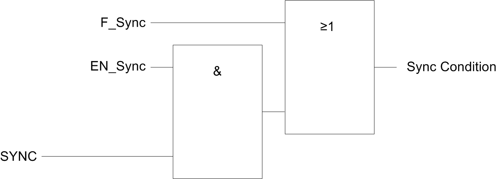

# Description

Description

This function is used to synchronize the counter depending on the status and the configuration of the optional SYNC physical input and the function block inputs F\_Sync and EN\_Sync.

This diagram illustrates the synchronization conditions:

EN\_Sync   input of the HSC function block

F\_Sync   input of the HSC function block

SYNC   physical input SYNC

The function block output Sync\_Flag is set to 1 when the Sync condition is reached.

The Sync condition operates on a rising edge.