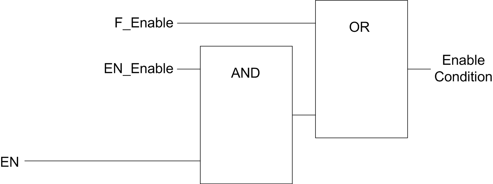

# Description

Description

This function is used to authorize changes to the current counter value depending on the status of the optional EN physical input and the function block inputs F\_Enable and EN\_Enable.

The diagrams illustrates the enable conditions:

EN\_Enable   input of the HSC function block

F\_Enable   input of the HSC function block

EN   physical input Enable

As long as the function is not enabled, the counting pulses are ignored.

NOTE: Enable condition for a Simple type corresponds to the function block inputs Enable.