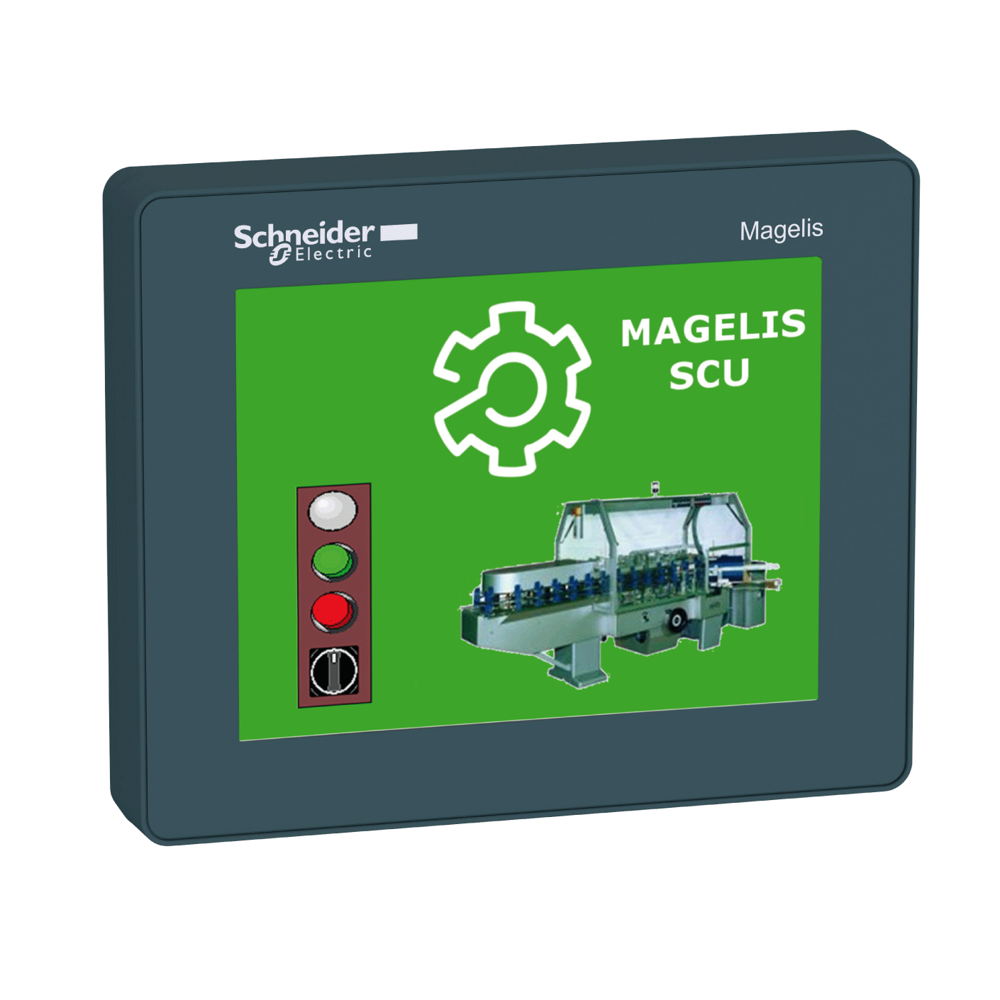

# HMI SCU Controller HSC - Library Guide

HMI SCU Controller HSC - Library Guide

Magelis SCU - HMI Controller - HSC Library Guide

This documentation will acquaint you with the High Speed Counter (HSC) functions and variables offered within the HMI SCU controller.

This documentation describes the functions and variables of the HMI SCU HSC library.

In order to use this manual, you must:

oHave a thorough understanding of the HMI SCU, including its design, functionality, and implementation within control systems.

oBe proficient in the use of the following IEC 61131-3 PLC programming languages:

oFunction Block Diagram (FBD)

oLadder Diagram (LD)

oStructured Text (ST)

oInstruction List (IL)

oSequential Function Chart (SFC)

The HMI SCU users should read through the entire document to understand all features.

EIO0000001512.04

© 2014 Schneider Electric. All rights reserved.