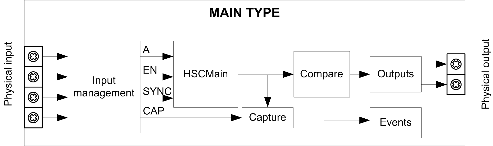

# Synopsis Diagram

Synopsis Diagram

Synopsis Diagram

This diagram provides an overview of the Main type in One-shot mode:

A is the counting input of the counter.

EN is the enable input of the counter.

CAP is the capture input of the counter.

SYNC is the synchronization input of the counter.

Optional Function

In addition to the One-shot mode, the Main type can provide the following functions:

o[Comparison function](../Comparison_Functionality/Comparison_Functionality-1.htm#XREF_D_SE_0006695_1)

o[Capture function](../Capture_Functionatity/Capture_Functionatity-1.htm#XREF_D_SE_0006698_1)

o[Synchronization function](../Synchronization,_Enable,_Reset_to_Zero,_Homing/Synchronization_Enable_Reset_to_Zero_Homing-2.htm#XREF_D_SE_0006708_1)

o[Enable function](../Synchronization,_Enable,_Reset_to_Zero,_Homing/Synchronization_Enable_Reset_to_Zero_Homing-3.htm#XREF_D_SE_0006709_1)

EIO0000001512.04

© 2014 Schneider Electric. All rights reserved.