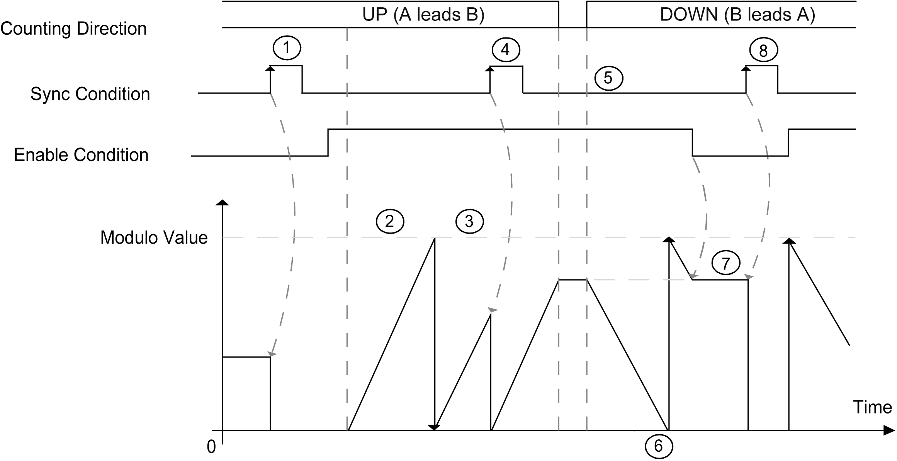

# Modulo-loop Principle

Modulo-loop Principle

Modulo-loop Mode Principle Description

Overview

The Modulo-loop type can be used for repeated actions on a series of moving objects, such as packaging and labeling applications.

Principle

On a rising edge of the [Sync condition](../Synchronization,_Enable,_Reset_to_Zero,_Homing/Synchronization_Enable_Reset_to_Zero_Homing-2.htm#XREF_D_SE_0006708_1), the counter is activated and the current value is reset to 0.

When counting is [enabled](../Synchronization,_Enable,_Reset_to_Zero,_Homing/Synchronization_Enable_Reset_to_Zero_Homing-3.htm#XREF_D_SE_0006709_1):

Incrementing direction: the counter increments until it reaches the modulo value. At the next pulse, the counter is reset to 0, a modulo flag is set to TRUE, and the counting continues.

Decrementing direction: the counter decrements until it reaches 0. At the next pulse, the counter is set to the modulo value, a modulo flag is set to TRUE, and the counting continues.

Principle Diagram

| Stage | Action |
| --- | --- |
| 1 | On the rising edge of Sync condition, the current value is reset to 0 and the counter is activated. |
| 2 | As long as Enable condition = TRUE, each pulse on A (for single phase) or each pulse pair with leading edge on signal A (for normal quadrature) increments the counter value. |
| 3 | When the counter reaches the (modulo-1) value, the counter loops to 0 at the next pulse and the counting continues. Modulo\_Flag is set to TRUE. |
| 4 | On the rising edge of Sync condition, the current counter value is reset to 0. |
| 5 | As long as Enable condition = TRUE, each pulse pair with a leading edge from signal B (for normal quadrature) decrements the counter. |
| 6 | When the counter reaches 0, the counter loops to (modulo-1) at the next pulse pair and the counting continues. |
| 7 | When Enable condition = FALSE, the pulses on the inputs are ignored. |
| 8 | On the rising edge of Sync condition, the current counter value is reset to 0. |

NOTE: Enable and Sync conditions depends on configuration. These are described in the [Enable](../Synchronization,_Enable,_Reset_to_Zero,_Homing/Synchronization_Enable_Reset_to_Zero_Homing-3.htm#XREF_D_SE_0006709_1) and [Synchronization](../Synchronization,_Enable,_Reset_to_Zero,_Homing/Synchronization_Enable_Reset_to_Zero_Homing-2.htm#XREF_D_SE_0006708_1) function.

EIO0000001512.04

© 2014 Schneider Electric. All rights reserved.