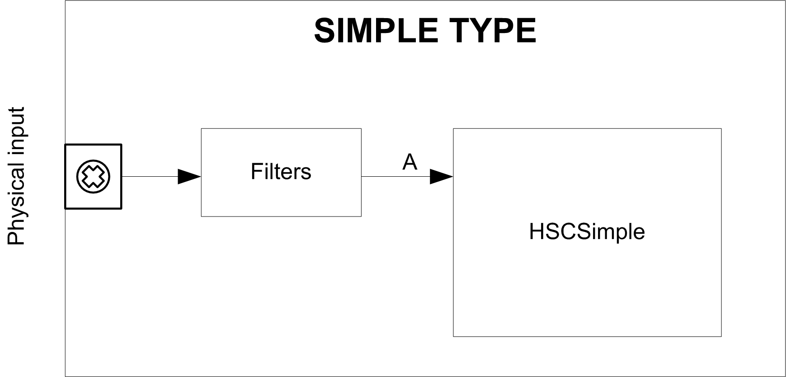

# Synopsis Diagram

Synopsis Diagram

Synopsis Diagram

This diagram provides an overview of the Simple type in Modulo-loop mode:

A is the counting input of the High Speed Counter.

A Simple type can only count up. Simple type counting for Modulo-loop mode only counts down. Simple type counting for One-shot mode only counts up.

EIO0000001512.04

© 2014 Schneider Electric. All rights reserved.