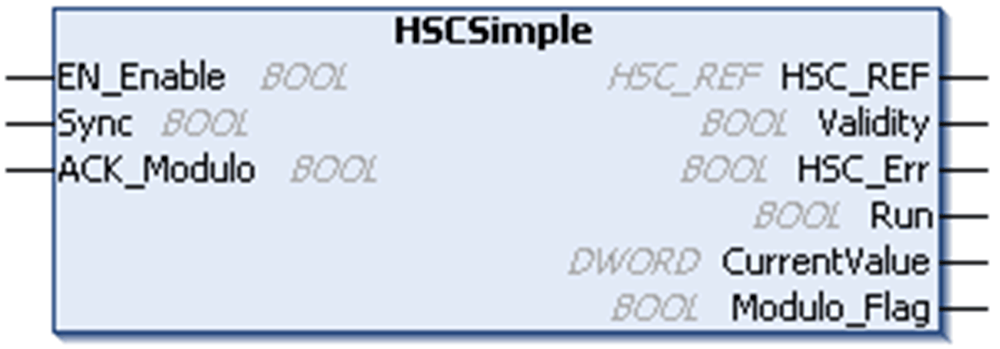

# Programming the Simple Type

Programming the Simple Type

Overview

A Simple type is always managed by an [HSCSimple](../HMI_SCU-OH-Embeeded_Functions_Configuration/HMI_SCU-OH-Embeeded_Functions_Configuration-4.htm#XREF_D_SE_0031194_1) function block.

NOTE: At build, an error is detected if the HSCSimple function block is used to manage a different HSC type.

Adding a HSCSimple Function Block

| Step | Description |
| --- | --- |
| 1 | Drag the Libraries > Controller > HMISCU > HMISCU\_HSC > HSCSimple FB to the Application tree > HMISCUxx5 > POU and drop it on the Start Here box in the lower window. |
| 2 | The instance name is located in the Variable field at the Device tree > HMISCU••5 > Embedded Functions > HSC > HSC0• with the HSC0• > Type that is set to Simple. |
| NOTE: This method is for ST, LD, or FBD languages. | |

I/O Variables Usage

The tables describe how the different pins of the function block are used in Modulo-loop mode.

The table describes the input variables:

| Input | Type | Comment |
| --- | --- | --- |
| EN\_Enable | BOOL | TRUE = authorizes changes to the current counter value. |
| Sync | BOOL | On rising edge, sets the counter value to 0. |
| ACK\_Modulo | BOOL | On rising edge, resets Modulo\_Flag. |

The table describes the output variables:

| Output | Type | Comment |
| --- | --- | --- |
| HSC\_REF | [HSC\_REF](../Data_Unit_Types/Data_Unit_Types-4.htm#XREF_D_SE_0007114_1) | Reference to the HSC.  To be used with the HSC\_REF\_IN input pin of the function blocks. |
| Validity | BOOL | TRUE = indicates that the output values on the function block are valid. |
| HSC\_Err | BOOL | TRUE = indicates that an error was detected.  [HSCGetDiag](../Function_Blocks/Function_Blocks-3.htm#XREF_D_SE_0006835_1) function block may be used to get more information about this detected error. |
| Run | BOOL | TRUE = indicates counter is running. |
| CurrentValue | DWORD | Current count value of the counter. |
| Modulo\_Flag | BOOL | Set to TRUE when the counter value rolls over the Modulo Value when counting up, or rolls over 0 when counting down. |

EIO0000001512.04

© 2014 Schneider Electric. All rights reserved.