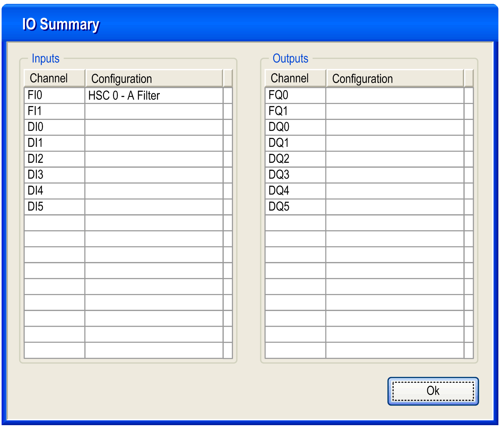

# Configuration of the Main Type in Modulo-loop Mode

Configuration of the Main Type in Modulo-loop Mode

Configuration Procedure

| Step | Action |
| --- | --- |
| 1 | In the Devices tree, double-click Embedded Functions > HSC. |
| 2 | Set the type to Main from the HSC0• > Type drop down menu. |
| 3 | The instance of the Main type is created, you can rename it from the Variable field. |
| 4 | Set the mode to Modulo-loop from the HSC0• > Parameters > Mode drop down menu. |
| 5 | Set the modulo value for Parameters > Preset/Modulo |
| 6 | Select an input mode value from the HSC0• > Clock Inputs > Input mode drop down menu. This enables the A Filter (and B Filter, depending on the Input mode used). |
| 7 | Set the anti-bounce filtering value from the Clock Inputs > A Filter (and B Filter, when applicable) drop down menu. |
| 8 | Optionally, enable the SYNC, EN (only if input mode = Single Phase) and CAP auxiliary inputs from the HSC0• > Auxiliary Inputs > SYNC or EN or CAP drop down menus, to enable the [Synchronization function](../Synchronization,_Enable,_Reset_to_Zero,_Homing/Synchronization_Enable_Reset_to_Zero_Homing-2.htm#XREF_D_SE_0006708_1), [Enable function](../Synchronization,_Enable,_Reset_to_Zero,_Homing/Synchronization_Enable_Reset_to_Zero_Homing-3.htm#XREF_D_SE_0006709_1) and [Capture function](../Capture_Functionatity/Capture_Functionatity-2.htm#XREF_D_SE_0006721_1) on a physical input. |
| 9 | Optionally, enable the thresholds from the drop down menu, by selecting HSC0• > Thresholds > Threshold 0 > Enable/Disabled to authorize the [Compare function and to configure the Reflex Outputs](../Comparison_Functionality/Comparison_Functionality-1.htm#XREF_D_SE_0006695_1).  NOTE: For the Modulo-Loop mode, configured values must follow the rule:  0 < Threshold 0 Value < Threshold 1 Value < (Modulo - 1) |

IO Summary

 Click the IO Summarize... button to display the input and output assignments.

[Refer to the hardware guide for wiring details](../../../../../../api/crossBook?lang=en-US&virtualBookName=SCUhw&topicID=D_SE_0024581_1).

Programmable Filter

The filtering value on the Main type input determines the counter maximum frequency as shown in the table:

| Input | Filter value | Maximum counter frequency |
| --- | --- | --- |
| A, B | 4 µs | 50 kHz |
| 40 µs | 14.5 kHz |

EIO0000001512.04

© 2014 Schneider Electric. All rights reserved.