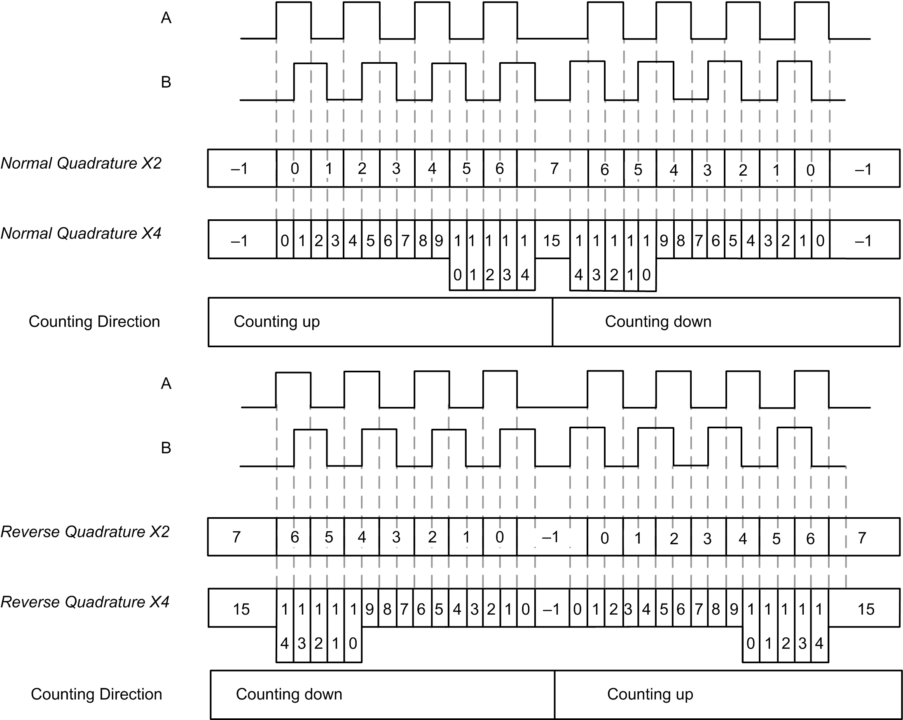

# Free-large Mode Principle Description

Free-large Mode Principle Description

Overview

The Free-large mode can be used for axis monitoring or labeling in cases where the incoming position of each part has to be known.

Principle

In the Free-large mode, quadrature is supported.

When counting is [enabled](../Synchronization,_Enable,_Reset_to_Zero,_Homing/Synchronization_Enable_Reset_to_Zero_Homing-3.htm#XREF_D_SE_0006709_1), the counter counts as follows in:

Incrementing direction: the counter increments.

Decrementing direction: the counter decrements.

With a Main type, on the rising edge of the [Sync condition](../Synchronization,_Enable,_Reset_to_Zero,_Homing/Synchronization_Enable_Reset_to_Zero_Homing-2.htm#XREF_D_SE_0006708_1), the counter is activated and the current value is set to the preset value.

The current counter is stored in the capture register by using the [Capture](../Capture_Functionatity/Capture_Functionatity-1.htm#XREF_D_SE_0006698_1) function.

If the counter reaches the counting limits, the counter will react according to the [Limits Management](Free_Large_With_HSC_Main_Type-3.htm#XREF_D_SE_0031181_1) configuration.

Input Modes

The table shows the 4 types of input modes available:

| Input Mode | Comment |
| --- | --- |
| Normal Quadrature X2 | A physical encoder always provides 2 signals 90° shift that first allows the counter to count pulses and detect direction:  oX2: 2 counts by Encoder cycle  oX4: 4 counts by Encoder cycle |
| Normal Quadrature X4 |
| Reverse Quadrature X2 |
| Reverse Quadrature X4 |

Quadrature Principle Diagram

The encoder signal is counted according to the input mode selected, as shown below:

The figures shows the affect of the inputs on the counter value for Normal Quadrature:

| Stage | Action |
| --- | --- |
| 1 | On the rising edge of Sync input, the current value is set to the configured preset value. |
| 2 | When Enable condition = TRUE, each pulse pair with leading edge on A increments the counter value. |
| 3 | On the rising edge of Preset condition, the current value is set to the configured preset value. |
| 4 | When Enable condition = TRUE, each pulse pair with leading edge on B decrements the counter value. |
| 5 | When Enable condition = FALSE, the all further pulses are ignored. |
| 6 | On the rising edge of Sync input, the current value is set to the configured preset value. |
| 7 | When Enable condition = TRUE, the pulse pair with leading edge on B decrements the counter value. |

EIO0000001512.04

© 2014 Schneider Electric. All rights reserved.