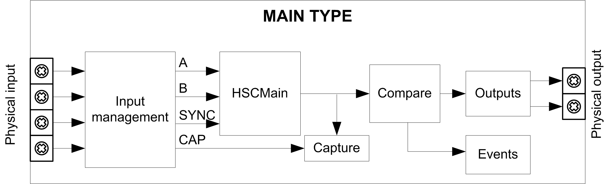

# Synopsis Diagram

Synopsis Diagram

Synopsis Diagram

This diagram provides an overview of the Main type in Free-large mode:

A and B are the counting inputs of the counter.

CAP is the capture input of the counter.

SYNC is the synchronization input of the counter.

Optional Function

In addition to the Free-large mode, the Main type can provide the following function:

o[Compare](../Comparison_Functionality/Comparison_Functionality-1.htm#XREF_D_SE_0006695_1)

o[Capture](../Capture_Functionatity/Capture_Functionatity-1.htm#XREF_D_SE_0006698_1)

o[Synchronize by a physical input](../Synchronization,_Enable,_Reset_to_Zero,_Homing/Synchronization_Enable_Reset_to_Zero_Homing-2.htm#XREF_D_SE_0006708_1)

EIO0000001512.04

© 2014 Schneider Electric. All rights reserved.