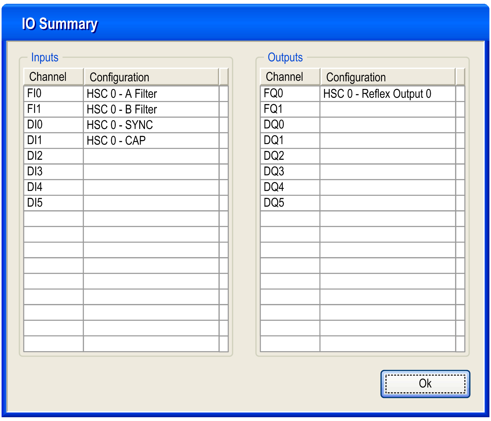

# Configuration of the Main Type in Free-Large Mode

Configuration of the Main Type in Free-Large Mode

Configuration Procedure

| Step | Action |
| --- | --- |
| 1 | In the Devices tree, double-click Embedded Functions > HSC node. |
| 2 | Set the type to Main from the HSC0• > Type drop down menu. |
| 3 | The instance of the Main type is created, you can rename it from the Variable field. |
| 4 | Set the mode to Free-large from the HSC0• > Parameters > Mode drop down menu. |
| 5 | Set the preset value from Parameters > Preset/Modulo  For the Free-Large, this parameter is the Preset Value. |
| 6 | Set the anti-bounce filtering value from the HSC0• > Clock Inputs > A Filter and B Filter >  drop down menus. |
| 7 | Optionally, enable the SYNC and CAP auxiliary inputs from the HSC0• > Auxiliary Inputs > SYNC or CAP drop down menus, to enable the [Synchronization function](../Synchronization,_Enable,_Reset_to_Zero,_Homing/Synchronization_Enable_Reset_to_Zero_Homing-2.htm#XREF_D_SE_0006708_1), and [Capture function](../Capture_Functionatity/Capture_Functionatity-1.htm#XREF_D_SE_0006698_1) on a physical input. |
| 8 | Optionally, enable the thresholds from the drop down menu, by selecting HSC0• > Thresholds > Threshold 0 to authorize the [Compare function and to configure the Reflex Outputs](../Comparison_Functionality/Comparison_Functionality-1.htm#XREF_D_SE_0006695_1).  NOTE: For the Free-large mode, configured values must follow the rule:  0 < Threshold 0 Value < Threshold 1 Value  Threshold values are not restricted by the Preset value for the Free-large mode. |

IO Summary

Click the IO Summarize... button to display the input and output assignments.

[Refer to the hardware guide for wiring details](../../../../../../api/crossBook?lang=en-US&virtualBookName=SCUhw&topicID=D_SE_0024639_5).

Programmable Filter

The filtering value on the Main type input determines the counter maximum frequency as shown in the table:

| Input | Filter value | Maximum counter frequency |
| --- | --- | --- |
| A, B | 4 µs | 50 kHz |
| 40 µs | 14.5 kHz |

EIO0000001512.04

© 2014 Schneider Electric. All rights reserved.