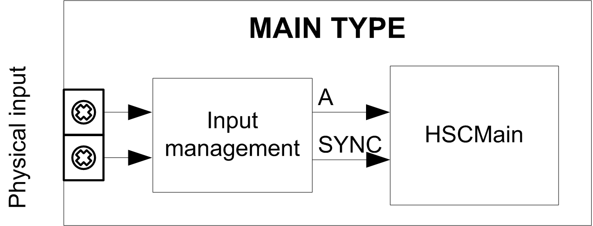

# Synopsis Diagram

Synopsis Diagram

Synopsis Diagram

This diagram provides an overview of the Main type in Event Counting mode.

A is the counting input of the counter.

SYNC is the synchronization input of the counter.

Optional Function

In addition to the Event Counting mode, the Main type provides the [Synchronization function](../Synchronization,_Enable,_Reset_to_Zero,_Homing/Synchronization_Enable_Reset_to_Zero_Homing-2.htm#XREF_D_SE_0006708_1).

EIO0000001512.04

© 2014 Schneider Electric. All rights reserved.