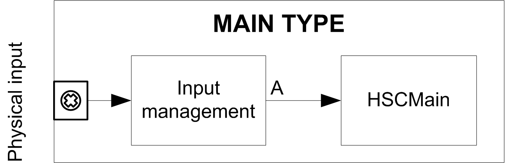

# Synopsis Diagram

Synopsis Diagram

Synopsis Diagram

This diagram provides an overview of the Main type in Frequency meter mode:

The Frequency meter counts the number of pulses on the physical input A over a predefined period of time. The value is stored in the counting register in Hz.

EIO0000001512.04

© 2014 Schneider Electric. All rights reserved.