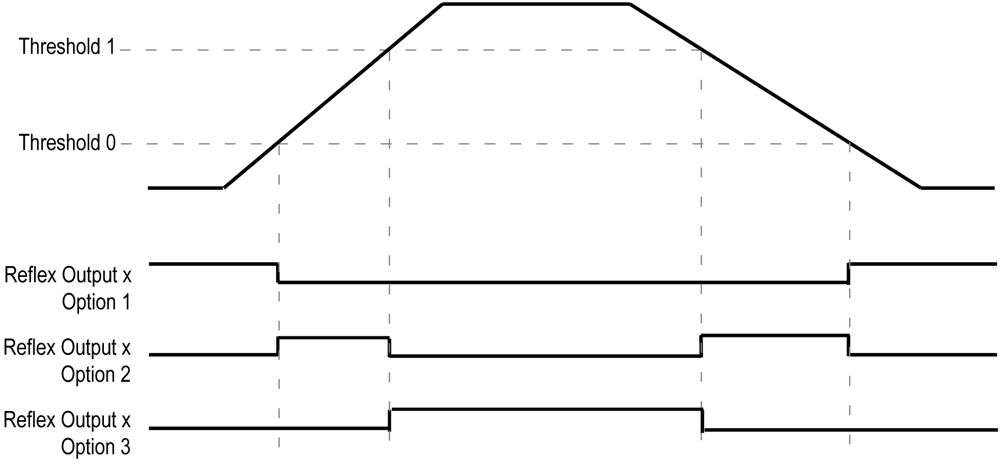

# Comparison Principle with a Main Type

Comparison Principle with a Main Type

Overview

The compare block with the Main type manages Thresholds, Reflex outputs and Events in the following modes:

o[One-shot](../One_Shot_With_HSC_Main_Type/One_Shot_With_HSC_Main_Type-1.htm#XREF_D_SE_0006661_1)

o[Modulo-loop](../Modulo_Loop_With_HSC_Main_Type/Modulo_Loop_With_HSC_Main_Type-1.htm#XREF_D_SE_0006666_1)

o[Free-Large](../Free_Large_With_HSC_Main_Type/Free_Large_With_HSC_Main_Type-1.htm#XREF_D_SE_0006670_1)

Comparison is configured in the [Configuration screen](Comparison_Functionality-3.htm#XREF_D_SE_0031233_1) by activating at least one threshold.

Comparison can be used to trigger:

o[programming action on thresholds](#XREF_D_SE_0031235_6)

o[an event on threshold associated with an external task](#XREF_D_SE_0031235_6)

o[reflex outputs](#XREF_D_SE_0031235_6)

Principle of a Comparison

The Main type can manage up to 2 thresholds.

A threshold is a configured value that is compared to the current counting value. Thresholds are used to define up to 3 zones or to react to a value crossing.

They are defined by configuration and can also be adjusted in the application program by using the [HSCSetParam](../Function_Blocks/Function_Blocks-5.htm#XREF_D_SE_0006848_1) function block.

If Thresholdx (x= 0, 1) is configured and comparison is enabled (EN\_Compare = TRUE), output pin THx of the function block is:

oOption 1:

Counting Up – Reflex Output x is TRUE when value < TH0 (reset when value = TH0).

Counting Down – Reflex Output x is TRUE when value ≤TH0 (set when value = TH0).

oOption 2:

Counting Up – Reflex Output x is TRUE when TH0 ≤ value < TH1 (set when value= TH0 and reset when value = TH1).

Counting Down – Reflex Output x is TRUE when TH0 < value ≤ TH1 (set when value = TH1 and reset when value = TH0).

oOption 3:

Counting Up – Reflex Output x is TRUE when value ≥TH1 (set when value = TH1).

Counting Down – Reflex Output x is TRUE when value > TH1 (reset when value =TH1).

NOTE: When EN\_Compare is set to FALSE on function block, comparison functions are disabled, including external tasks triggered by a threshold event and Reflex outputs.

This diagram shows the state of the Reflex Output (fast digital output) for each individual option:

Threshold Behavior

TH0 and TH1 are managed by the task and are updated at the rate of the task cycle time.

Configuring Event

Configuring an event on threshold crossing allows to trigger an [external task](Comparison_Functionality-4.htm#XREF_D_SE_0034605_2). You can choose to trigger an event when a configured threshold is crossed downward, upward, or both ways.

When the HSC is counting:

oup, the configured External Event Task is triggered when the counting value = Threshold value + 1

odown, the configured External Event Task is triggered when the counting value = Threshold value - 1

If overflow or underflow, no External Event Task is triggered.

Reflex Output Behavior

Configuring reflex outputs allows to trigger physical reflex outputs.

These outputs are not controlled in the task context, reducing the reaction time to a minimum. This is convenient for operations that need fast execution.

Outputs used by the High Speed Counter can only be accessed through the function block. They cannot be read or written directly within the application.

NOTE: The state of the reflex outputs depends on the [configuration](Comparison_Functionality-3.htm#XREF_D_SE_0031233_3).

Changing the Threshold Values

The TH0, TH1, Reflex0, Reflex1, Out0 and Out1 as well as physical outputs will operate with respect to the threshold values, even when the threshold values are dynamically changed as long as SuspendCompare= TRUE.

Therefore, care must be exercised when threshold compares are active to avoid unintended or unexpected results from the physical reflex outputs and HSCMain function block outputs. If the compare function is disabled, threshold values can be modified without worry of unintended outputs. However, if the compare function is enabled, you must, at least, suspend the threshold compare function while modifying the threshold values.

|  |
| --- |
| Warning_Color.gifWARNING |
| UNINTENDED EQUIPMENT OPERATION |
| oDo not change the Threshold values without using the SuspendCompare input if EN\_Compare = 1.  oEnsure that TH0 is less than TH1 before reactivating the threshold compare function. |
| Failure to follow these instructions can result in death, serious injury, or equipment damage. |

| Step | Action |
| --- | --- |
| 1 | Set SuspendCompare to TRUE.  The comparison is frozen at the current value:  oTH0, TH1, Reflex0, Reflex1, Out0, Out1 output bits of the block maintain their last value.  oPhysical Outputs 0, 1 maintain their last value  NOTE: EN\_Compare, EN\_Out0, EN\_Out1, F\_Out0, F\_Out1 remain operational while SuspendCompare is set. |
| 2 | Modify the Threshold values as needed using the [HSCSetParam](../Function_Blocks/Function_Blocks-5.htm#XREF_D_SE_0006848_1) function block.  NOTE:  Follow these rules to configure the threshold values:  oFor the One-shot mode:  0 < Threshold 0 Value < Threshold 1 Value < (Preset - 1)  oFor the Modulo-Loop mode:  0 < Threshold 0 Value < Threshold 1 Value < (Modulo - 1)  oFor the Free-large mode:  0 < Threshold 0 Value < Threshold 1 Value  The threshold values are not restricted by the Preset value for Free-large mode. |
| 3 | Set SuspendCompare to FALSE.  The new Threshold values are applied and the comparison is resumed. |

EIO0000001512.04

© 2014 Schneider Electric. All rights reserved.