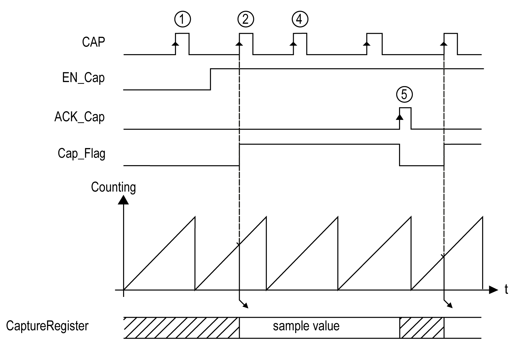

# Capture Principle with a Main Type

Capture Principle with a Main Type

Overview

The capture function stores the current counter value upon an external input signal.

The capture function is available in Main type with the following modes:

o[One-shot](../One_Shot_With_HSC_Main_Type/One_Shot_With_HSC_Main_Type-1.htm#XREF_D_SE_0006661_1)

o[Modulo-loop](../Modulo_Loop_With_HSC_Main_Type/Modulo_Loop_With_HSC_Main_Type-1.htm#XREF_D_SE_0006666_1)

o[Free-large](../Free_Large_With_HSC_Main_Type/Free_Large_With_HSC_Main_Type-1.htm#XREF_D_SE_0006670_1)

Using this function requires to:

oconfigure the optional Capture input: CAP

ouse [HSCGetCapturedValue](../Function_Blocks/Function_Blocks-2.htm#XREF_D_SE_0006830_1) function block to retrieve the captured value in your application.

Principle of a Capture

This graphic illustrates how the capture works in Modulo-loop mode:

| Stage | Action |
| --- | --- |
| 1 | When EN\_Cap = 0, the function is not operational. |
| 2 | When EN\_Cap = 1, the edge on CAP captures the current counter value and puts it into the Capture register, and triggers the rising edge of Cap\_Flag. |
| 3 | Get the stored value using [HSCGetCapturedValue](../Function_Blocks/Function_Blocks-2.htm#XREF_D_SE_0006830_1). |
| 4 | While Cap\_Flag = 1, any new edge on the physical input CAP is ignored. |
| 5 | The rising edge of HSCMain function block input ACK\_Cap triggers the falling edge Cap\_Flag output.  A new capture is authorized. |

EIO0000001512.04

© 2014 Schneider Electric. All rights reserved.