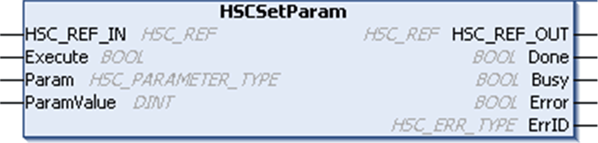

# HSCSetParam: Adjust Parameters of a HSC

HSCSetParam: Adjust Parameters of a HSC

Function Description

This administrative function block modifies the value of a parameter of an HSC.

Graphical Representation

IL and ST Representation

To see the general representation in IL or ST language, refer to the [Function and Function Block Representation](../Function_and_Function_Block_Representation/Function_and_Function_Block_Representation-1.htm#XREF_D_SE_0002384_1) chapter.

I/O Variables Description

This table describes the input variables:

| Inputs | Type | Comment |
| --- | --- | --- |
| HSC\_REF\_IN | [HSC\_REF](../Data_Unit_Types/Data_Unit_Types-4.htm#XREF_D_SE_0007114_1) | Reference to the HSC.  Must not be changed during block execution. |
| Execute | BOOL | On rising edge, starts the function block execution.  On falling edge, resets the outputs of the function block when its execution terminates. |
| Param | [HSC\_PARAMETER\_TYPE](../Data_Unit_Types/Data_Unit_Types-3.htm#XREF_D_SE_0007113_1) | Parameter to read. |
| ParamValue | DINT | Parameter value to write. |

This table describes the output variables:

| Outputs | Type | Comment |
| --- | --- | --- |
| HSC\_REF\_OUT | [HSC\_REF](../Data_Unit_Types/Data_Unit_Types-4.htm#XREF_D_SE_0007114_1) | Reference to the HSC. |
| Done | BOOL | TRUE = indicates that the parameter was successfully written.  Function block execution is finished. |
| Busy | BOOL | TRUE = indicates that the function block execution is in progress. |
| Error | BOOL | TRUE = indicates that an error was detected.  Function block execution is finished. |
| ErrID | [HSC\_ERR\_TYPE](../Data_Unit_Types/Data_Unit_Types-2.htm#XREF_D_SE_0007110_1) | When Error is TRUE: type of the detected error. |

NOTE: For more information about Done, Busy, and Execution pins, refer to [General Information on Function Block Management](../MSD_LMC058_-PWM_Library-General_Information/MSD_LMC058_-PWM_Library-General_Information-3.htm#XREF_D_SE_0003299_1).

Adding the HSCSetParam Function Block

| Step | Description |
| --- | --- |
| 1 | Select the Libraries tab in the Software Catalog and click Libraries.  Select Controller > HMISCU > HMISCU HSC > HSCSetParam in the list, drag-and-drop the item onto the POU window. |
| 2 | Link the HSC\_REF\_IN input to the HSC\_REF output of the HSC. |

EIO0000001512.04

© 2014 Schneider Electric. All rights reserved.