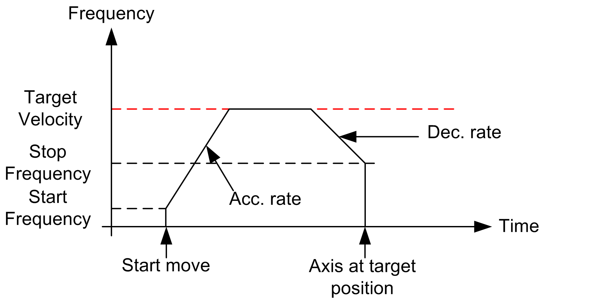

# Configure a PTO Channel

Configure a PTO Channel

| Step | Action |
| --- | --- |
| 1 | Enable the PTO channel by selecting PTO in the PTO0• > Mode drop down menu. |
| 2 | Select the mode of generation of outputs in the PTO0• > Output Mode drop down menu. |
| 3 | Configure the [Acc./Dec. Unit, Acc.max, Dec. max, and Dec. Fast stop](M238Lib_PTO_PTO_Config-3.htm#XREF_D_SE_0031143_6) parameters. |
| 4 | Configure the [Frequency](M238Lib_PTO_PTO_Config-3.htm#XREF_D_SE_0031143_9) parameters: Start, Stop, and Maximum. |
| 5 | Optionally enable the [AUX input](M238Lib_PTO_PTO_Config-3.htm#XREF_D_SE_0031143_12). |
| 6 | Configure the PTO0• > AUX input filtering value (if enabled at step 5). |

The configuration defined can be viewed as a configuration profile:

