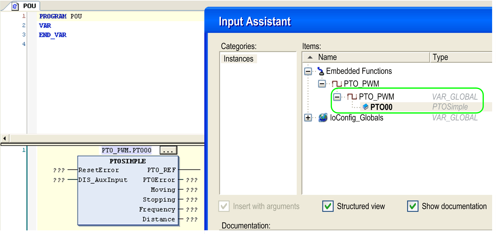
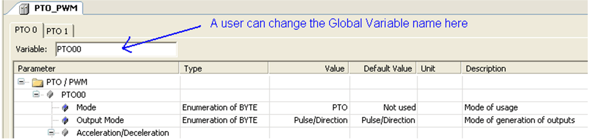

# Overview

Overview

The PTOSimple function block manages the PTO function.

Call the function block in each cycle of the [MAST](../glossary/glossary.htm#XREF_D_SE_0024697_150) [task](../glossary/glossary.htm#XREF_D_SE_0024697_175).

The function block instance name is the name defined by configuration.

It is created when a user invokes PTO mode on Channel PTO 0 from the Embedded Functions configuration:

NOTE: Assign the function block instance name to the Global Variable PTO\_PWM.PTO00.

