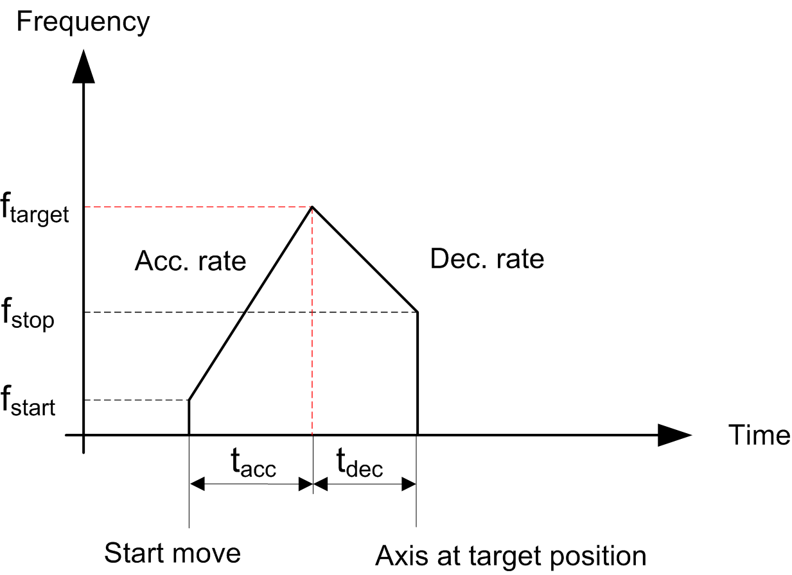
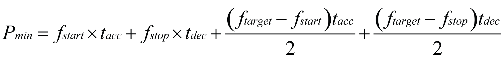
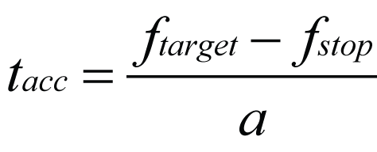
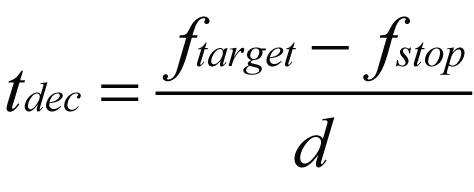

# Case 1: Minimum Number of Pulses

Case 1: Minimum Number of Pulses

The distance input enables you to specify the movement from the current position of the axis to the target position. The distance input is the number of pulses that are required to perform the movement. The parameters defined by you can define the minimum number of pulses required to meet the target velocity. The distance (for example, the number of pulses) corresponds to the area under the frequency (for example, velocity) profile.

The axis follows this profile:

If we consider the limit case where the target frequency is reached at only one point, then the profile follows a triangular profile.

The minimum number of pulses Pmin is then defined as:

fstart   start frequency

fstop   stop frequency

ftarget   velocity target

tacc   acceleration time (1)

tdec   deceleration time (2)

NOTE:

(1) If you have defined an acceleration (a) instead of acceleration time (tacc) then the following formula applies:

(2) If you have defined a deceleration rate (d) instead of deceleration time (tdec) then the following formula applies:

