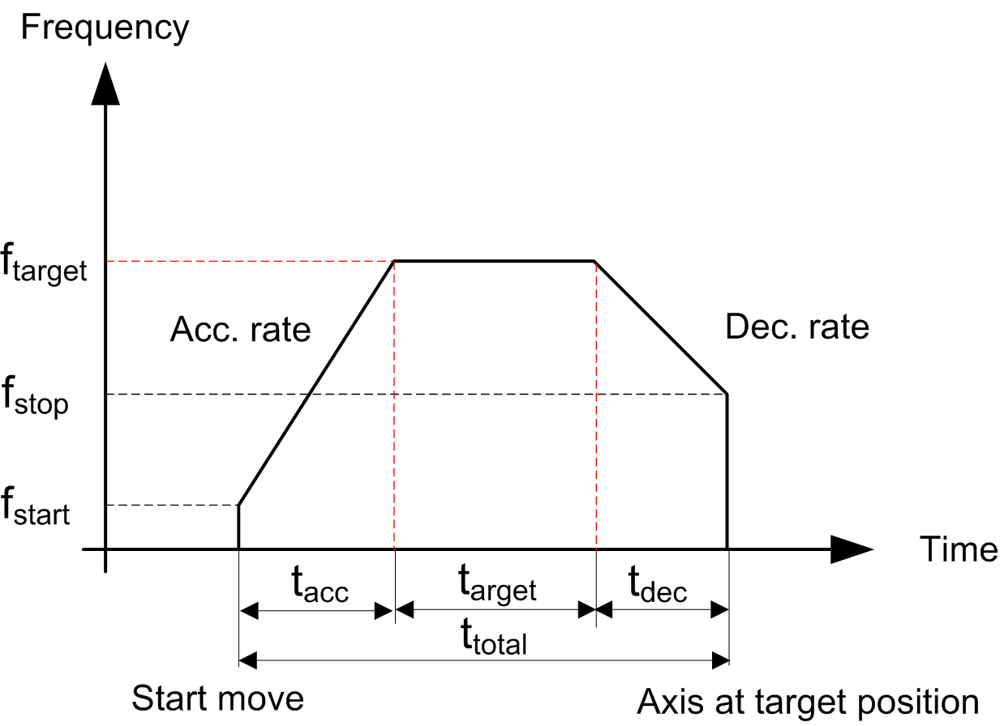
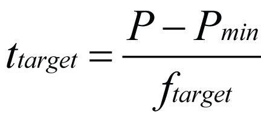

# Case 2: Number of Pulses Greater than the Minimum (Trapezoidal Profile)

Case 2: Number of Pulses Greater than the Minimum (Trapezoidal Profile)

When you set a number of pulses greater than the minimum number of pulses required to perform the movement at the distance input, the velocity of the axis follows a trapezoidal profile:

In a trapezoidal profile you define:

oAcceleration time (tacc) or acceleration rate (a) (2)

oDeceleration time (tdec) or deceleration rate (d) (2)

oFrequency target (ftarget)

oStart frequency: (fstart)

oStop frequency: (fstop)

oDistance or number of pulses (P) (1)

From these parameters we can obtain:

oTime while in-velocity (ttarget)

oTotal time of operation (ttotal)

NOTE:

o(1) In this case, the number of pulses is greater than or equal to the minimum number of pulses (refer to the [Minimum Number of Pulses](#XREF_D_SE_0031474_15).

o(2) If acceleration/deceleration rates are defined, use the [formula](#XREF_D_SE_0031474_15) to obtain the acc/dec times in ms.

First, the calculation of the minimum number of pulses is required [(Pmin)](#XREF_D_SE_0031474_15):

The total time of operation ttotal is defined by:

