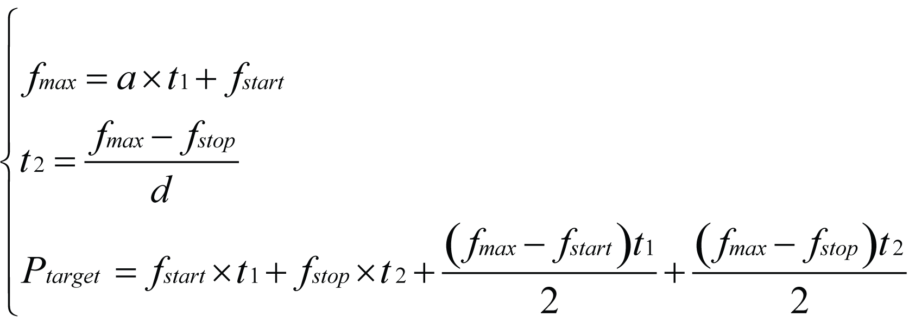
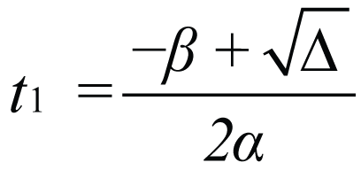
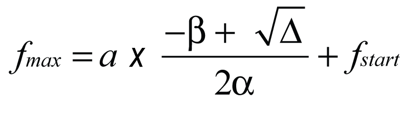

# Case 3: Number of Pulses Less than the Minimum

Case 3: Number of Pulses Less than the Minimum

If you define a distance input less than the minimum number of pulses described in [Minimum Number of Pulses](#XREF_D_SE_0031474_15), the target frequency is not reached. The HMI SCU firmware shortens the function block output acc/dec times (t1 and t2) and lowers the maximum frequency that can be reached (fmax).

The axis follows this profile:

In this profile:

oRecalculated acceleration time (t1) (1)

oRecalculated deceleration time (t2) (1)

oFrequency target (ftarget)

oStart frequency: (fstart)

oStop frequency: (fstop)

oDistance or number of pulses (P)

NOTE: (1) If milliseconds is chosen for the unit of acceleration and deceleration, then a = ftarget/tacc and d = ftarget/tdec is used when solving the system of equations.

You can obtain these three values (t1, t2 and fmax) by solving the following system:

oFor the system described above, the shortened acceleration time, t1, is given by:

Where:

oThe shortened deceleration time, t2, is given by:

o The maximum reached frequency, fmax, is given by:

NOTE: If the new fmax ≤ either the Start Frequency or the Stop Frequency, a PTO error is detected and no motion control is started.

NOTE: If the Distance = 1, 2 or 3 pulses. The pulses are output at the configured Stop Frequency. This is useful for manual positioning by jogging a motor.