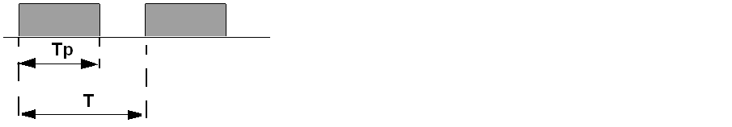
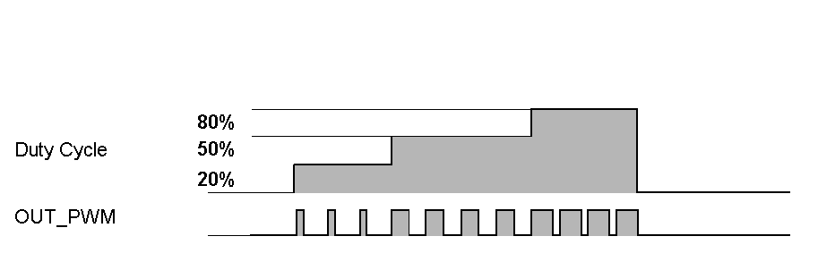
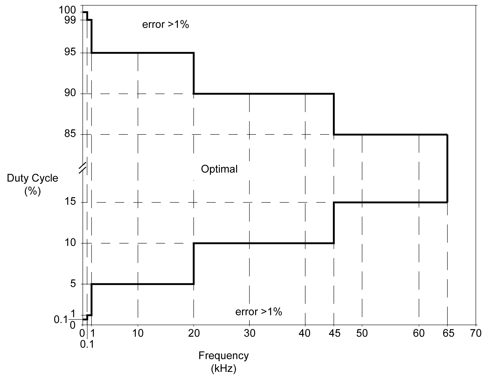

# Signal Form

Signal Form

The signal form depends on the following input parameters:

oFrequency configurable from 10 Hz to 65 kHz with a 0.1 Hz step

oDuty Cycle of the output signal from 0% to 100%

Duty Cycle=Tp/T

Tp   pulse width

T   pulse period (1/Frequency)

Modifying the duty cycle in the program modulates the width of the signal. Below is an illustration of an output signal with varying duty cycles.

The table describes the characteristics of the PWM outputs:

| Characteristic | | Value | |
| --- | --- | --- | --- |
| Accuracy / PWM mode | Frequency | Duty | Error |
| 10...100 Hz | 0...100% | 0.1% |
| 101...1000 Hz | 1...99% | 1% |
| 1.001...20 kHz | 5...95% | 5% |
| 20.001...45 kHz | 10...90% | 10% |
| 45.001...65 kHz | 15...85% | 15% |
| PWM mode duty rate step | | 20 Hz...1 kHz for 0.1% | |
| Duty rate range | | 1...99% | |

When duty cycle is below 5% or above 95%, depending on the frequency, the error is above 1% as illustrated in the graphic below:

