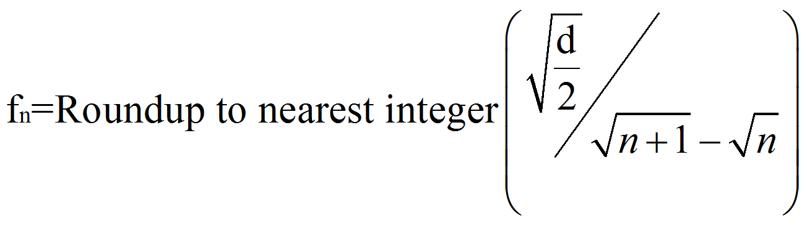
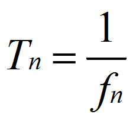

# PTOMoveRelative: Deceleration Pulses Calculation

PTOMoveRelative: Deceleration Pulses Calculation

To calculate the period Tn (in seconds) between pulses during deceleration, the frequency fn is rounded up to the nearest integer for that pulse period is calculated:

d deceleration rate in Hz/s

This diagram depicts when Frequency Start = 0 Hz:

n is a positive integer representing the nth pulse period from the end of the deceleration phase.