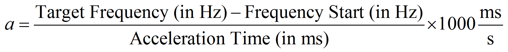
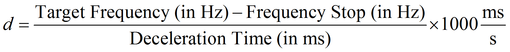

# PTOMoveRelative: Determining Acceleration Rate (a) and Deceleration Rate (d)

PTOMoveRelative: Determining Acceleration Rate (a) and Deceleration Rate (d)

If the units of Acc./Dec. Unit is set to ms, the acceleration rate in Hz/s is:

If the units of Acc./Dec. Unit are set to ms, the deceleration rate in Hz/s is:

The Target Frequency is value from the Velocity input pin from PTOMoveRelative function block.

The acceleration/deceleration time is the Acceleration/Deceleration input pins from the PTOMoveRelative function block.

If the units of Acc./Dec. Unit is set to Hz/ms, the acceleration/deceleration rate are that of the Acceleration/Deceleration pins on the PTOMoveRelative function block.