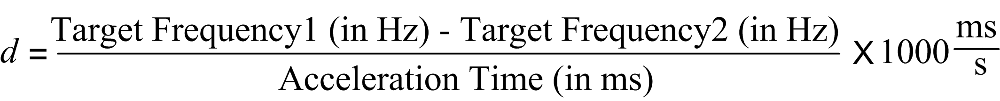

# PTOMoveVelocity: Acceleration and Deceleration Pulses Calculation

PTOMoveVelocity: Acceleration and Deceleration Pulses Calculation

If the units of Acc./Dec. Unit is set to ms, the acceleration rate from a motionless axis (current frequency = 0 Hz) in Hz/s is:

When a new motion command is issued when the axis is currently in motion from a previous motion command:

oif the new velocity is greater than the previous velocity and if the units of Acc./Dec. Unit is set to ms, the acceleration rate from an axis currently in motion from a previous motion command to a in Hz/s is:

oif the new velocity is less than the previous velocity and if the units of Acc./Dec. Unit is set to ms, the deceleration rate from an axis currently in motion from a previous motion command in Hz/s is:

Where:

Target Frequency is value from the Velocity input pin from PTOMoveVelocity function block for a motion command that accelerates from a motionless axis (0 Hz).

Target Frequency1 is the current constant velocity of the axis from a previous motion command.

Target Frequency2 is the velocity target for the next motion command.

The acceleration/deceleration time is the Acceleration/Deceleration input pins from the PTOMoveVelocity function block.

If the units of Acc./Dec. Unit is set to Hz/ms, the acceleration/deceleration rate are that of the Acceleration/Deceleration pins on the PTOMoveVelocity function block.