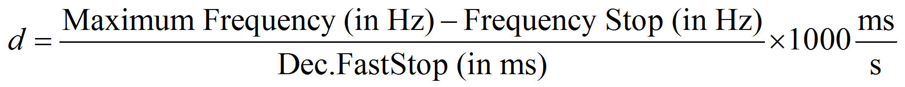

# Dec. Fast Stop

Dec. Fast Stop

If the units of Acc./Dec. Unit are set to ms, the deceleration rate in Hz/s is:

Maximum Frequency and Dec. Fast Stop are set in the PTO configuration user interface (or with PTOSetParam during program operation).

If the units of acceleration/deceleration are set to Hz/ms, the deceleration rate is that of the Dec. Fast Stop rate set in the PTO configuration user interface.