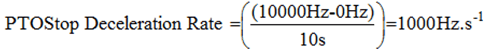
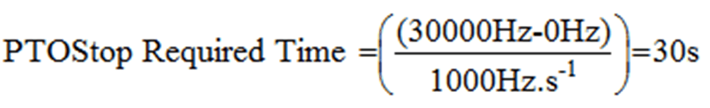

# Case 3: Example

Case 3: Example

The following actions take place in this sequence:

oStop Frequency is configured to be 0 Hz.

oPTOMoveVelocity is executed for the first time with the Target Velocity = 50 kHz.

oThe PTO output reaches 50 kHz.

oA new PTOMoveVelocity command is issued to decelerate to 100 kHz in 20 seconds.

o10 seconds elapse. At this instance in time, the instantaneous output frequency is:

oPTOStop command is issued with 10000 ms set in the Deceleration input pin. The deceleration rate of PTOStop will be calculated to be:

Therefore, the time the PTOStop command is issued to the time the PTO output is stopped requires:

NOTE: You will notice that 30 seconds is a longer time than set in the original PTOStop command (10 s).