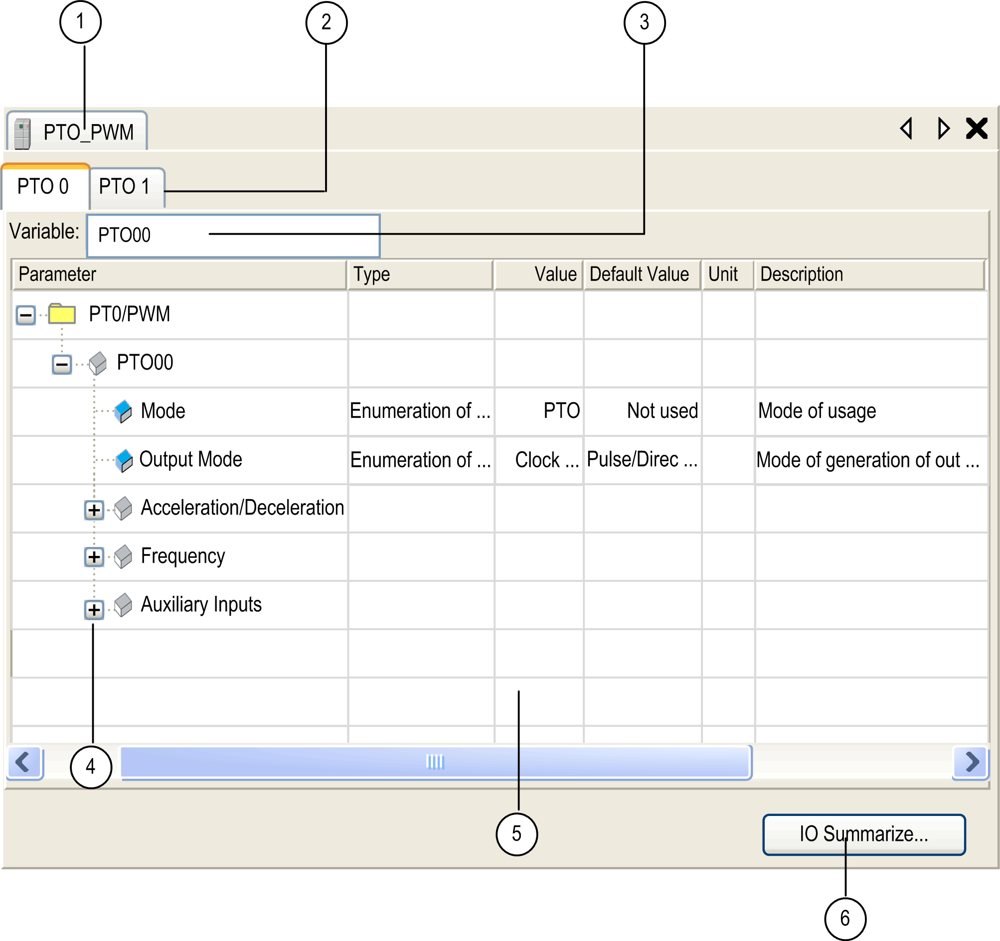

# HMI SCU Embedded Functions

HMI SCU Embedded Functions

PTO\_PWM Embedded Function

Overview

The PTO embedded function can provide 2 different functions:

PTO The PTO (Pulse Train Output) [implements digital technology](../M238Lib_PTO_Overview/M238Lib_PTO_Overview.htm#XREF_D_SE_0006943_1) that provides precise positioning for open loop control of motor drives.

PWM The PWM (Pulse Width Modulation) function generates a programmable square wave signal on a [dedicated output](../M238Lib_PWM_and_FG/M238Lib_PWM_and_FG.htm#XREF_D_SE_0006982_1) with adjustable duty cycle and frequency.

Accessing the PTO\_PWM Configuration Window

| Step | Description |
| --- | --- |
| 1 | In the Devices tree, double-click HMISCUxx5 > Embedded Functions > PTO\_PWM.  Result: The PTO\_PWM window is displayed. |

PTO\_PWM Configuration Window

The figure shows a sample PTO\_PWM configuration window used to configure a PTO or PWM:

The table describes the areas of the PTO\_PWM configuration window:

| Number | Action |
| --- | --- |
| 1 | If necessary, select the PTO\_PWM tab to access the PTO\_PWM configuration Windows. |
| 2 | Select a specific PTO tab to access the PTO\_PWM channel to configure. |
| 3 | Choose the type of PTO\_PWM, (PTO (default) or PWM).  Use the field Variable to change the Global Variable name representing the instance of the channel.  NOTE: The default variable name for PTO 0 channel is PTO00. For PTO 1 channel, it is PTO01. |
| 4 | You can expand each parameter by clicking the plus sign next to it to access its settings. |
| 5 | Configuration window where the embedded function is used for:  oPTO  oPWM |
| 6 | Click the IO Summarize button.  Result: The IO Summary window appears that shows the configured I/O mapping. |

For detailed information on configuration parameters, refer to:

o[PTO configuration](../M238Lib_PTO_PTO_Config/M238Lib_PTO_PTO_Config-1.htm#XREF_D_SE_0006945_1).

o[PWM configuration](../M238Lib_PWM/M238Lib_PWM-3.htm#XREF_D_RU_0004962_1).

EIO0000001518.05

© 2016 Schneider Electric. All rights reserved.