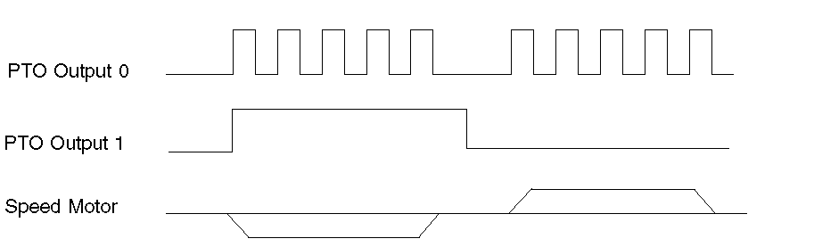

# Configuration Parameters Description

Configuration Parameters Description

Output Modes

2 possible output modes are as follows:

oPulse/Direction

oDirection/Pulse

The Pulse/Direction mode generates 2 signals on the PTO outputs:

oon output 0: pulse which provides the motor operating speed.

oon output 1: direction which provides the motor rotation direction.

The Direction/Pulse mode generates 2 signals on the PTO outputs:

oon output 0: direction which provides the motor rotation direction.

oon output 1: pulse which provides the motor operating speed.

This diagram gives an example of a timing diagram in Pulse/Direction mode:

Acceleration/Deceleration

| Parameter | Value | Description |
| --- | --- | --- |
| Acc./Dec. Unit | ms | The Acceleration and the Deceleration expressed in ms. |
| Hz/ms | The Acceleration and the Deceleration expressed in Hz/ms. |
| Acc. max.  Dec. max. | ms | Acc./Dec. which cannot be exceeded by any motion command in the application program.  NOTE: If the Acc. max. or Dec. max. is exceeded by a motion command, the motion command will return an error and decelerate to 0 Hz at the Dec. Fast stop rate.  ms The value specifies the lowest value of Acc./Dec. time that can be used.  Hz/ms The value specifies the highest value of Acc./Dec. rate that can be used. |
| Dec. Fast stop | ms | Defines the value of Deceleration rate used to stop the PTO signal in case of a detected error:  omotion command error  ocommand sequence error  ocontroller leaves RUN mode  oDrive Ready input low  Dec. Fast stop is also triggered when:  oHMI goes into Offline Configuration mode.  oHMI goes to Exit Runtime mode (HMI power-down feature used to ensure all logging to file system is closed properly).  NOTE: The Deceleration time is limited to approximately 6 seconds before just going straight to 0 Hz. |

This example shows a possible configuration of Acceleration/Deceleration and Frequency parameters:

| Parameter | Value | Units |
| --- | --- | --- |
| Acc./Dec. Time | 10,000 | ms |
| Start Frequency and Stop Frequency | 5,000 | Hz |
| Target Velocity | 20,000 | Hz |

In your application program, using a PTOMoveRelative command with an Acceleration Time of 10,000 ms and a Target Velocity of 20 kHz, then the Target Velocity will be reached after 10,000 ms with an acceleration rate of 1.5 Hz/ms.

The equivalent acceleration rate = (Target Velocity - Start Frequency)/Acc. = (20 kHz-5 kHz)/10000 ms = 1.5 Hz/ms

Frequency

| Parameter | Description |
| --- | --- |
| Start | Start frequency is the initial frequency value when a motion command begins. |
| Stop | Stop frequency is the final frequency value before a motion command stops. |
| Maximum | User-defined frequency which cannot be exceeded by any command in the application program. If a command with a desired velocity above the Maximum Frequency is executed, an error will be returned and the axis will do a Dec. Fast Stop. |

Auxiliary Input

| Parameter | Description |
| --- | --- |
| AUX | The auxiliary input parameter has two possible settings:  oDrive Ready  oNot used  Drive Ready The state of the PTO 0 - AUX physical input (DI2) determines whether the PTO move commands are authorized.  When TRUE = Authorizes the PTO moving commands.  When FALSE = An axis error is triggered and any move ongoing is aborted by a Fast stop.  The input DIS\_AuxInput of the [PTOSimple function block](../M238Lib_PTO_PTO_Config_Reference_the_axis/M238Lib_PTO_PTO_Config_Reference_the_axis-2.htm#XREF_D_SE_0007003_1) can be used to disable the drive ready monitoring. |
| AUX Filter | Filtering value reduces the effect of bounce on the auxiliary input. |

EIO0000001518.05

© 2016 Schneider Electric. All rights reserved.