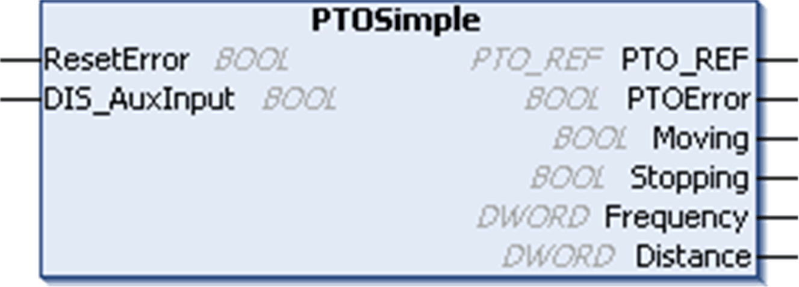

# PTOSimple Function Block

PTOSimple Function Block

Overview

The PTOSimple function block manages the PTO function.

Call the function block in each cycle of the [MAST](../glossary/glossary.htm#XREF_D_SE_0024697_150) [task](../glossary/glossary.htm#XREF_D_SE_0024697_175).

The function block instance name is the name defined by configuration.

It is created when a user invokes PTO mode on Channel PTO 0 from the Embedded Functions configuration:

NOTE: Assign the function block instance name to the Global Variable PTO\_PWM.PTO00.

Graphical Representation

IL and ST Representation

To see the general representation in IL or ST language, refer to the chapter [Function and Function Block Representation](../Function_and_Function_Block_Representation/Function_and_Function_Block_Representation-1.htm#XREF_D_SE_0002384_1).

I/O Variables Description

This table describes the input [variables](../glossary/glossary.htm#XREF_D_SE_0024697_600):

| Inputs | Type | Comment |
| --- | --- | --- |
| ResetError | BOOL | On rising edge, resets the detected PTO error.  NOTE: The Execute pin on any PTOMoveRelative tied to the PTO00 axis must be set to FALSE for resetting detected errors. |
| DIS\_AuxInput | BOOL | TRUE = disables the auxiliary input when configured as Drive Ready input.  This pin has no effect when auxiliary input is not used. |

This table describes the output variables:

| Outputs | Type | Comment |
| --- | --- | --- |
| PTO\_REF | [PTO\_REF](../MSD_M2xx_PTO_PWM_Library_CHAP_DATA/MSD_M2xx_PTO_PWM_Library_CHAP_DATA-5.htm#XREF_D_RU_0005007_1) | Reference to the PTO channel.  To be used with the PTO\_REF\_IN input pin of the PTO function blocks. |
| PTOError | BOOL | TRUE = indicates that an error was detected. Use PTOGetDiag [function block](../M238Lib_PTO_Administrative_Blocks/M238Lib_PTO_Administrative_Blocks-8.htm#XREF_D_RU_0005010_1) to get more information about this detected error. |
| Moving | BOOL | TRUE = indicates that the motion state is moving. |
| Stopping | BOOL | TRUE = indicates that the motion state is stopping. |
| Frequency | DWORD | Current velocity (in Hz) of the move. |
| Distance | DWORD | Distance traveled by the current move of the PTO axis (in number of pulses). |

EIO0000001518.05

© 2016 Schneider Electric. All rights reserved.