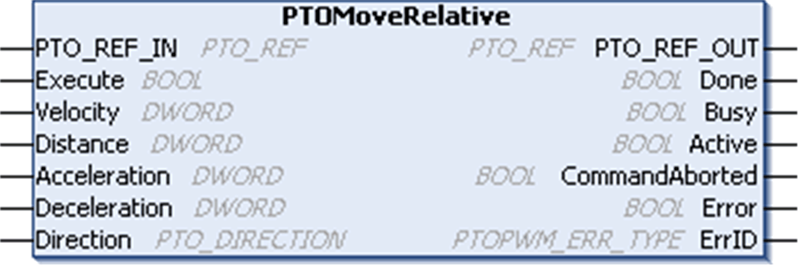

# PTOMoveRelative Function Block

PTOMoveRelative Function Block

Function Description

The function block commands a move of a distance relative to the current position.

The move profile depends on the specified velocity, deceleration, and acceleration values.

Graphical Representation

IL and ST Representation

To see the general representation in IL or ST language, refer to the chapter [Function and Function Block Representation](../Function_and_Function_Block_Representation/Function_and_Function_Block_Representation-1.htm#XREF_D_SE_0002384_1).

I/O Variables Description

The table describes the input variables:

| Inputs | Type | Comment |
| --- | --- | --- |
| PTO\_REF\_IN | [PTO\_REF](../MSD_M2xx_PTO_PWM_Library_CHAP_DATA/MSD_M2xx_PTO_PWM_Library_CHAP_DATA-5.htm#XREF_D_RU_0005007_1) | Reference to the PTO channel.  To be connected to the PTO\_REF of the PTOSimple or the PTO\_REF\_OUT output pins of other PTO function blocks. |
| Execute | BOOL | On rising edge, starts the function block execution.  Output status pins continue to output the current status while the Move is happening, whether or not the Execute pin is true or not. |
| Velocity | DWORD | Target/Desired Velocity in Hz (not necessarily reached.)  Range: 1...Maximum frequency of the output  NOTE:  oWhen Velocity is set to 0, and the function block is executed, an error will be returned (PTO\_INVALID\_PARAMETER).  oIf the Velocity is less than the configured non-zero Start Frequency or Stop Frequency, an error will be returned (PTO\_INVALID\_PARAMETER).  oIf the Start Frequency or Stop Frequency is configured as zero, and the Velocity is set to ≤ the calculated Start/Stop Frequency, there will be no acceleration or deceleration phase. The output frequency will simply be that of the Velocity. |
| Distance | DWORD | Distance of the move in number of pulses.  Range: 1...4294967295  NOTE: If the Distance is 1, 2 or 3 pulses, the pulses will simply be output at the configured Stop Frequency. |
| Acceleration | DWORD | Acceleration in Hz/ms or in ms (according to configuration).  Range Hz/ms: 1...Acc. max.  Range ms: Acc. max....49999 |
| Deceleration | DWORD | Deceleration in Hz/ms or in ms (according to configuration).  Range Hz/ms: 1...Dec. max.  Range ms: Dec. max....49999 |
| Direction | [PTO\_DIRECTION](../MSD_M2xx_PTO_PWM_Library_CHAP_DATA/MSD_M2xx_PTO_PWM_Library_CHAP_DATA-3.htm#XREF_D_RU_0005005_1) | Direction of the move (forward or backward). |

The table describes the output variables:

| Outputs | Type | Comment |
| --- | --- | --- |
| PTO\_REF\_OUT | [PTO\_REF](../MSD_M2xx_PTO_PWM_Library_CHAP_DATA/MSD_M2xx_PTO_PWM_Library_CHAP_DATA-5.htm#XREF_D_RU_0005007_1) | Reference to the PTO channel.  To be connected with the PTO\_REF\_IN input pins of other PTO function blocks. |
| Done | BOOL | TRUE = indicates that the command is finished.  Function block execution is finished. |
| Busy | BOOL | TRUE = indicates that the command is in progress. |
| Active | BOOL | This output is set at the moment the function block takes control of the motion of the axis. |
| CommandAborted | BOOL | TRUE = indicates that the command was aborted due to another move command.  Function block execution is finished. |
| Error | BOOL | TRUE = indicates that an error was detected.  Function block execution is finished.  NOTE: Errors must be reset before a new motion command is executed. Otherwise any new motion commands will be ignored. |
| ErrID | [PTOPWM\_ERR\_TYPE](../MSD_M2xx_PTO_PWM_Library_CHAP_DATA/MSD_M2xx_PTO_PWM_Library_CHAP_DATA-2.htm#XREF_D_RU_0005008_1) | When Error is TRUE: type of the detected error. |

NOTE: For more information about Done, Busy, CommandAborted and Execution pins, refer to [General Information on Function Block Management](../MSD_LMC058_-PWM_Library-General_Information/MSD_LMC058_-PWM_Library-General_Information-3.htm#XREF_D_SE_0003299_3).

EIO0000001518.05

© 2016 Schneider Electric. All rights reserved.