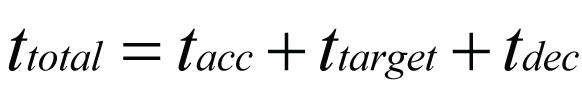
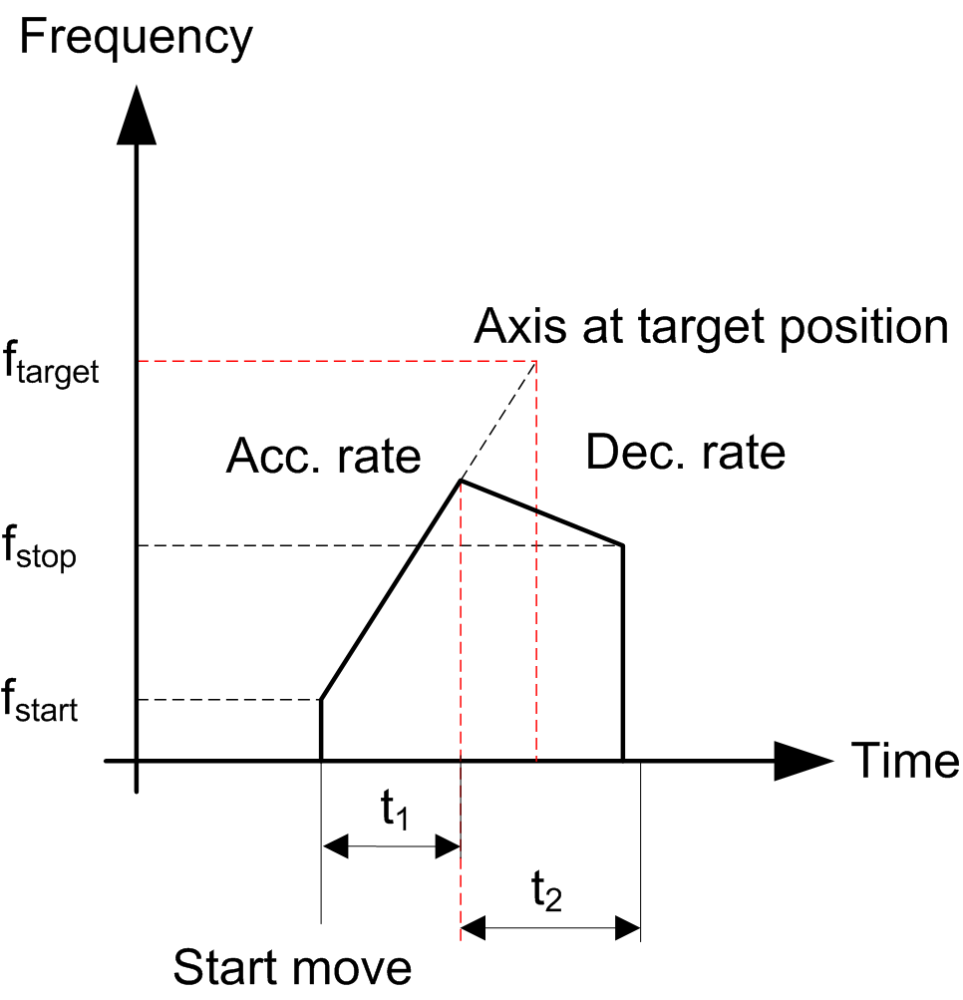
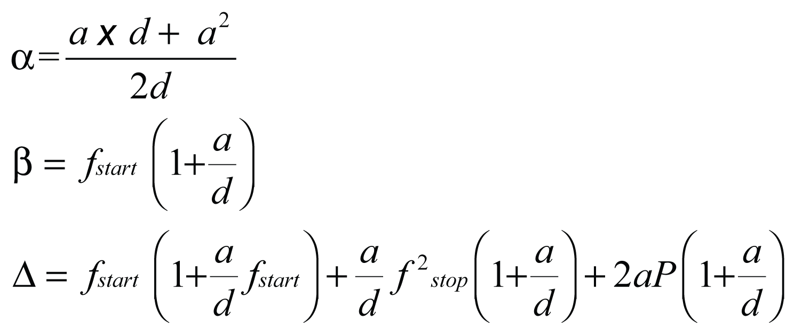
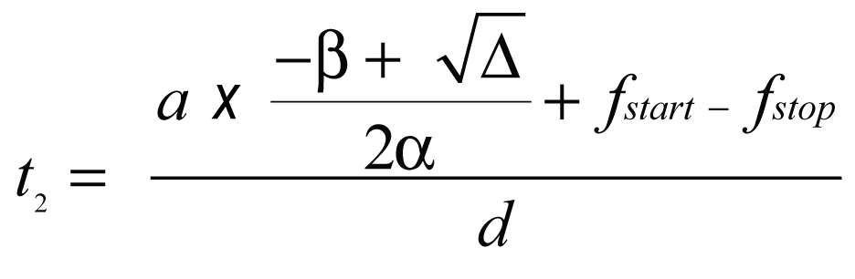

# Pulse and Time Calculations with PTOMoveRelative

Pulse and Time Calculations with PTOMoveRelative

Overview

When using PTOMoveRelative, the total number of pulses is respected unless interrupted.

Therefore, it is important to note that there are three possible movement profile cases depending on your parameters:

oThe minimum number of pulses required to reach the target frequency is met exactly.

oWhen the total pulses specified is greater than the number of minimum pulses required to reach the target frequency (trapezoidal profile).

oWhen the total pulses specified is less than the minimum number of pulses required to reach the target frequency.

Case 1: Minimum Number of Pulses

The distance input enables you to specify the movement from the current position of the axis to the target position. The distance input is the number of pulses that are required to perform the movement. The parameters defined by you can define the minimum number of pulses required to meet the target velocity. The distance (for example, the number of pulses) corresponds to the area under the frequency (for example, velocity) profile.

The axis follows this profile:

If we consider the limit case where the target frequency is reached at only one point, then the profile follows a triangular profile.

The minimum number of pulses Pmin is then defined as:

fstart   start frequency

fstop   stop frequency

ftarget   velocity target

tacc   acceleration time (1)

tdec   deceleration time (2)

NOTE:

(1) If you have defined an acceleration (a) instead of acceleration time (tacc) then the following formula applies:

(2) If you have defined a deceleration rate (d) instead of deceleration time (tdec) then the following formula applies:

Case 2: Number of Pulses Greater than the Minimum (Trapezoidal Profile)

When you set a number of pulses greater than the minimum number of pulses required to perform the movement at the distance input, the velocity of the axis follows a trapezoidal profile:

In a trapezoidal profile you define:

oAcceleration time (tacc) or acceleration rate (a) (2)

oDeceleration time (tdec) or deceleration rate (d) (2)

oFrequency target (ftarget)

oStart frequency: (fstart)

oStop frequency: (fstop)

oDistance or number of pulses (P) (1)

From these parameters we can obtain:

oTime while in-velocity (ttarget)

oTotal time of operation (ttotal)

NOTE:

o(1) In this case, the number of pulses is greater than or equal to the minimum number of pulses (refer to the [Minimum Number of Pulses](#XREF_D_SE_0031474_15).

o(2) If acceleration/deceleration rates are defined, use the [formula](#XREF_D_SE_0031474_15) to obtain the acc/dec times in ms.

First, the calculation of the minimum number of pulses is required [(Pmin)](#XREF_D_SE_0031474_15):

The total time of operation ttotal is defined by:

Case 3: Number of Pulses Less than the Minimum

If you define a distance input less than the minimum number of pulses described in [Minimum Number of Pulses](#XREF_D_SE_0031474_15), the target frequency is not reached. The HMI SCU firmware shortens the function block output acc/dec times (t1 and t2) and lowers the maximum frequency that can be reached (fmax).

The axis follows this profile:

In this profile:

oRecalculated acceleration time (t1) (1)

oRecalculated deceleration time (t2) (1)

oFrequency target (ftarget)

oStart frequency: (fstart)

oStop frequency: (fstop)

oDistance or number of pulses (P)

NOTE: (1) If milliseconds is chosen for the unit of acceleration and deceleration, then a = ftarget/tacc and d = ftarget/tdec is used when solving the system of equations.

You can obtain these three values (t1, t2 and fmax) by solving the following system:

oFor the system described above, the shortened acceleration time, t1, is given by:

Where:

oThe shortened deceleration time, t2, is given by:

o The maximum reached frequency, fmax, is given by:

NOTE: If the new fmax ≤ either the Start Frequency or the Stop Frequency, a PTO error is detected and no motion control is started.

NOTE: If the Distance = 1, 2 or 3 pulses. The pulses are output at the configured Stop Frequency. This is useful for manual positioning by jogging a motor.

EIO0000001518.05

© 2016 Schneider Electric. All rights reserved.