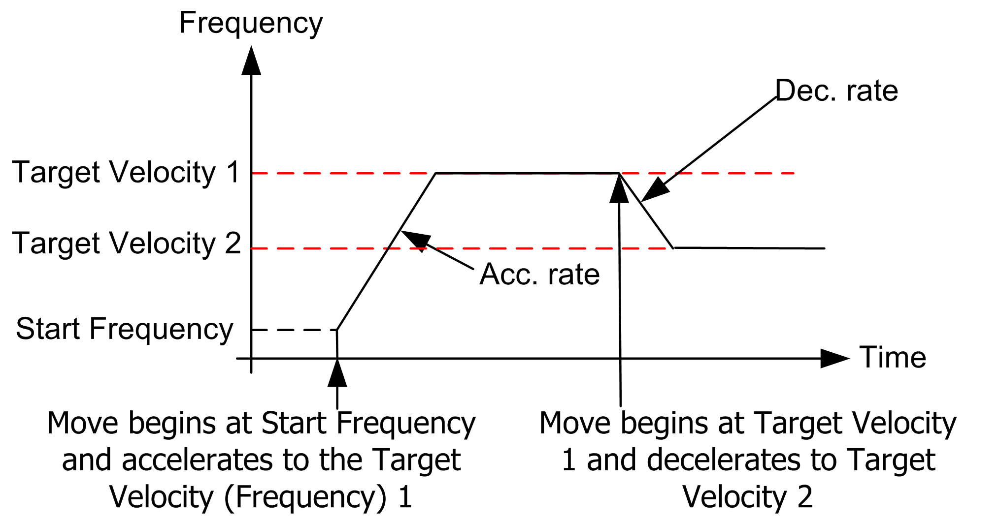

# Description

Description

Overview

Speed control is a reference to the control of the motor velocity.To control the speed of the motor associated with the PTO channel, use the PTOMoveVelocity function block.

The PTOMoveVelocity function block is used to generate a pulse train output at a specified frequency (velocity) through an acceleration or deceleration ramp.

When the PTOMoveVelocity command is executed, the current [Motion State](M238Lib_PTO_MoveCommands-16.htm#XREF_D_SE_0007005_1) is Continuous Motion.

A target velocity of 0 Hz is not allowed in PTOMoveVelocity for HMISCU.

The graph below illustrates two consecutive PTOMoveVelocity commands:

In order to stop the continuous motion, execute the [PTOStop](M238Lib_PTO_MoveCommands-13.htm#XREF_D_RU_0005017_1) command.

EIO0000001518.05

© 2016 Schneider Electric. All rights reserved.