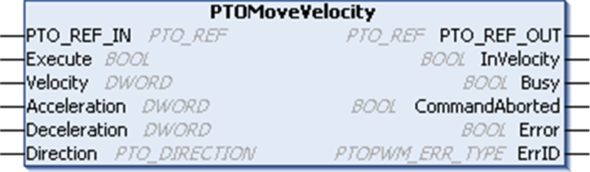

# PTOMoveVelocity Function Block

PTOMoveVelocity Function Block

Function Description

This function block commands a continuous move at a specified velocity.

This velocity is reached according to specified acceleration and deceleration values.

A new PTOMoveVelocity motion command with new velocity and acceleration/deceleration values can be issued while the axis is in motion when the last specified velocity is reached.

Graphical Representation

IL and ST Representation

To see the general representation in IL or ST language, refer to the chapter [Function and Function Block Representation](../Function_and_Function_Block_Representation/Function_and_Function_Block_Representation-1.htm#XREF_D_SE_0002384_1).

I/O Variables Description

This table describes the input variables:

| Inputs | Type | Comment |
| --- | --- | --- |
| PTO\_REF\_IN | [PTO\_REF](../MSD_M2xx_PTO_PWM_Library_CHAP_DATA/MSD_M2xx_PTO_PWM_Library_CHAP_DATA-5.htm#XREF_D_RU_0005007_1) | Reference to the PTO axis.  To be connected to the PTO\_REF of the PTOSimple or the PTO\_REF\_OUT of the PTO function blocks. |
| Execute | BOOL | On rising edge, starts the function block execution.  When FALSE, resets the outputs of the function block when its execution terminates. |
| Velocity | DWORD | Target velocity in Hz.  Range: 1...Frequency max  NOTE: The Velocity cannot be less than the Start Frequency when executing PTOMoveVelocity from a stopped axis. The Velocity can be set to a frequency less than the Start Frequency only if the axis is already in motion at a constant frequency from a previous PTOMoveVelocity motion command. |
| Acceleration | DWORD | Acceleration in Hz/ms or in ms (according to configuration).  Range Hz/ms: 1...Acc. max.  Range ms: Acc. max....49999 |
| Deceleration | DWORD | Deceleration in Hz/ms or in ms (according to configuration).  Range Hz/ms: 1...Dec. max.  Range ms: Dec. max....49999 |
| Direction | [PTO\_DIRECTION](../MSD_M2xx_PTO_PWM_Library_CHAP_DATA/MSD_M2xx_PTO_PWM_Library_CHAP_DATA-3.htm#XREF_D_RU_0005005_1) | Direction of the move. |

NOTE: The acceleration and deceleration ramps cannot exceed 4,294,967,295 pulses. At the maximum frequency of 50 kHz, it would limit the duration of acc/dec ramps to 40 seconds.

NOTE: For a new PTOMoveVelocity motion command when the axis is in motion, the specified velocity from the previous motion command must be reached ( InVelocity =TRUE). Executing PTOMoveVelocity during acceleration or deceleration phase (while Busy =TRUE) will abort the command and stop the axis at the configured Dec. Fast Stop rate.

This table describes the output variables:

| Outputs | Type | Comment |
| --- | --- | --- |
| PTO\_REF\_OUT | [PTO\_REF](../MSD_M2xx_PTO_PWM_Library_CHAP_DATA/MSD_M2xx_PTO_PWM_Library_CHAP_DATA-5.htm#XREF_D_RU_0005007_1) | Reference to the PTO channel.  To be connected with the PTO\_REF\_IN input pin of the PTO function blocks. |
| InVelocity | BOOL | TRUE = indicates that target velocity is reached.  The move is ongoing and the last function block command execution is finished. |
| Busy | BOOL | TRUE = indicates that the command is in progress. |
| CommandAborted | BOOL | TRUE = indicates that the command was aborted due to another move command.  Function block execution is finished. |
| Error | BOOL | TRUE = indicates that an error was detected.  Function block execution is finished. |
| ErrID | [PTOPWM\_ERR\_TYPE](../MSD_M2xx_PTO_PWM_Library_CHAP_DATA/MSD_M2xx_PTO_PWM_Library_CHAP_DATA-2.htm#XREF_D_RU_0005008_1) | When Error is TRUE: type of the detected error. |

NOTE: For more information about Done, Busy, CommandAborted and Execution pins, refer to [General Information on Function Block Management](../MSD_LMC058_-PWM_Library-General_Information/MSD_LMC058_-PWM_Library-General_Information-3.htm#XREF_D_SE_0003299_3).

EIO0000001518.05

© 2016 Schneider Electric. All rights reserved.