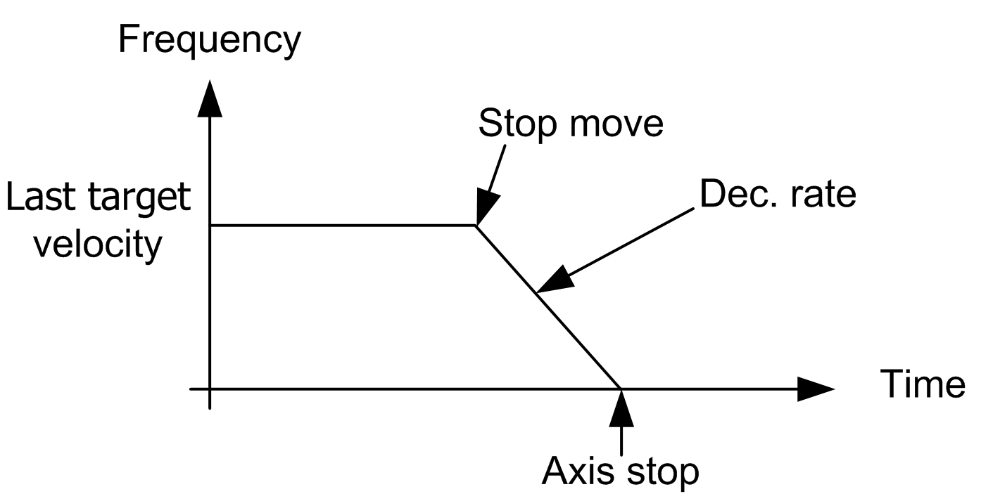

# Description

Description

Overview

This function block commands a controlled stop of the axis (deceleration to stop), and aborts any motion ongoing.

After the axis has been completely stopped, a new motion is not allowed as long as the Execute input remains TRUE or an axis error was detected and has not been [reset](../M238Lib_PTO_PTO_Config_Reference_the_axis/M238Lib_PTO_PTO_Config_Reference_the_axis-2.htm#XREF_D_SE_0007003_1).

NOTE: If the PTOStop function block is executed, the last output pulse frequency will be the Stop Frequency. For more information, see [deceleration pulses calculation](../MSD_LMC058_-PWM_Library-General_Information/MSD_LMC058_-PWM_Library-General_Information-4.htm#XREF_D_SE_0031738_1).

EIO0000001518.05

© 2016 Schneider Electric. All rights reserved.