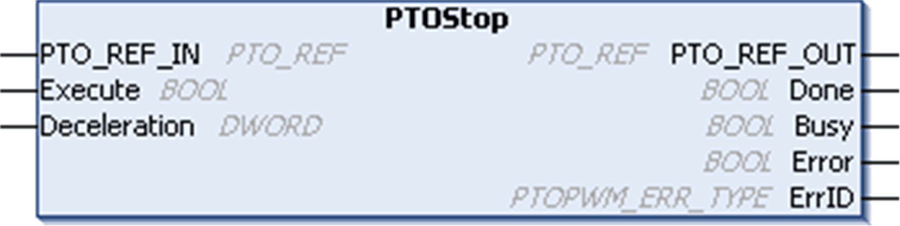

# PTOStop Function Block

PTOStop Function Block

Function Description

This function block commands a controlled stop of the axis (deceleration to stop), and aborts any motion ongoing.

Graphical Representation

IL and ST Representation

To see the general representation in IL or ST language, refer to the chapter [Function and Function Block Representation](../Function_and_Function_Block_Representation/Function_and_Function_Block_Representation-1.htm#XREF_D_SE_0002384_1).

I/O Variables Description

This table describes the input variables:

| Inputs | Type | Comment |
| --- | --- | --- |
| PTO\_REF\_IN | [PTO\_REF](../MSD_M2xx_PTO_PWM_Library_CHAP_DATA/MSD_M2xx_PTO_PWM_Library_CHAP_DATA-5.htm#XREF_D_RU_0005007_1) | Reference to the PTO channel.  To be connected to the PTO\_REF of the PTOSimple or the PTO\_REF\_OUT of the PTO function blocks. |
| Execute | BOOL | On rising edge, starts the function block execution.  When FALSE, resets the outputs of the function block when its execution terminates. |
| Deceleration | DWORD | Deceleration in Hz/ms or in ms (according to configuration).  Range for rate (in Hz/ms): 1...Dec. max.  Range for time (in ms): Dec. max....49999 |

This table describes the output variables:

| Outputs | Type | Comment |
| --- | --- | --- |
| PTO\_REF\_OUT | [PTO\_REF](../MSD_M2xx_PTO_PWM_Library_CHAP_DATA/MSD_M2xx_PTO_PWM_Library_CHAP_DATA-5.htm#XREF_D_RU_0005007_1) | Reference to the PTO channel.  To be connected with the PTO\_REF\_IN input pin of the PTO function blocks. |
| Done | BOOL | TRUE = indicates that the command is finished.  Function block execution is finished. |
| Busy | BOOL | TRUE = indicates that the command is in progress. |
| Error | BOOL | TRUE = indicates that an error was detected.  Function block execution is finished. |
| ErrID | [PTOPWM\_ERR\_TYPE](../MSD_M2xx_PTO_PWM_Library_CHAP_DATA/MSD_M2xx_PTO_PWM_Library_CHAP_DATA-2.htm#XREF_D_RU_0005008_1) | When Error is TRUE: type of the detected error. |

NOTE: For more information about Done, Busy, CommandAborted and Execution pins, refer to [General Information on Function Block Management](../MSD_LMC058_-PWM_Library-General_Information/MSD_LMC058_-PWM_Library-General_Information-3.htm#XREF_D_SE_0003299_3).

EIO0000001518.05

© 2016 Schneider Electric. All rights reserved.