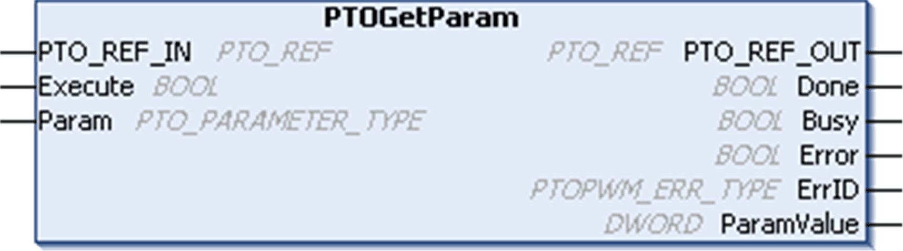

# PTOGetParam Function Block

PTOGetParam Function Block

Function Description

This function block returns the value of a specific parameter for a specified PTO channel.

Graphical Representation

IL and ST Representation

To see the general representation in IL or ST language, refer to the chapter [Function and Function Block Representation](../Function_and_Function_Block_Representation/Function_and_Function_Block_Representation-1.htm#XREF_D_SE_0002384_1).

I/O Variables Description

This table describes the input variables:

| Inputs | Type | Comment |
| --- | --- | --- |
| PTO\_REF\_IN | [PTO\_REF](../MSD_M2xx_PTO_PWM_Library_CHAP_DATA/MSD_M2xx_PTO_PWM_Library_CHAP_DATA-5.htm#XREF_D_RU_0005007_1) | Reference to the PTO channel.  To be connected to the PTO\_REF of the PTOSimple or the PTO\_REF\_OUT of the PTO function blocks. |
| Execute | BOOL | On a rising edge, starts the function block execution.  When FALSE, does not reset the outputs of the function block. The output pins of this function block always show the last status until next rising edge of the Execution input. |
| Param | [PTO\_PARAMETER\_TYPE](../MSD_M2xx_PTO_PWM_Library_CHAP_DATA/MSD_M2xx_PTO_PWM_Library_CHAP_DATA-4.htm#XREF_D_RU_0005006_1) | Parameter to read. |

This table describes the output variables:

| Outputs | Type | Comment |
| --- | --- | --- |
| PTO\_REF\_OUT | [PTO\_REF](../MSD_M2xx_PTO_PWM_Library_CHAP_DATA/MSD_M2xx_PTO_PWM_Library_CHAP_DATA-5.htm#XREF_D_RU_0005007_1) | Reference to the PTO channel.  To be connected with the PTO\_REF\_IN input pin of the PTO function blocks. |
| Done | BOOL | TRUE = indicates that the ParamValue is valid.  Function block execution is finished. |
| Busy | BOOL | TRUE = indicates that the function block execution is in progress. |
| Error | BOOL | TRUE = indicates that an error was detected.  Function block execution is finished. |
| ErrID | [PTOPWM\_ERR\_TYPE](../MSD_M2xx_PTO_PWM_Library_CHAP_DATA/MSD_M2xx_PTO_PWM_Library_CHAP_DATA-2.htm#XREF_D_RU_0005008_1) | When Error is TRUE: type of detected error. |
| ParamValue | DWORD | When Done is TRUE: Parameter value is valid. |

NOTE: For more information about Done, Busy, CommandAborted and Execution pins, refer to [General Information on Function Block Management](../MSD_LMC058_-PWM_Library-General_Information/MSD_LMC058_-PWM_Library-General_Information-3.htm#XREF_D_SE_0003299_3).

EIO0000001518.05

© 2016 Schneider Electric. All rights reserved.