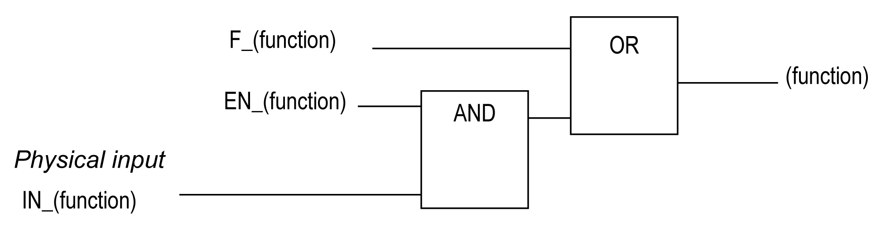
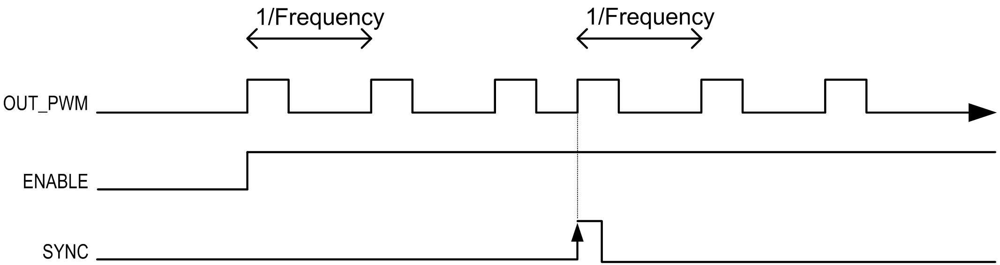

# Synchronization and Enable Functions

Synchronization and Enable Functions

Introduction

This section presents the functions used by the PWM:

oSynchronization function

oEnable function

Each function uses the 2 following function block bits:

oEN\_(function) bit: Setting this bit to 1 allows the (function) to operate on an external physical input if configured.

oF\_(function) bit: Setting this bit to 1 forces the (function).

The following diagram explains how the function is managed:

NOTE: (function) stands either for Enable (for Enable function) or Sync (for Synchronization function).

If the physical input is required, enable it in the configuration screen.

Synchronization Function

The Synchronization function is used to interrupt the current PWM cycle and then restart a new cycle.

Enable Function

The Enable function is used to activate the PWM:

EIO0000001518.05

© 2016 Schneider Electric. All rights reserved.