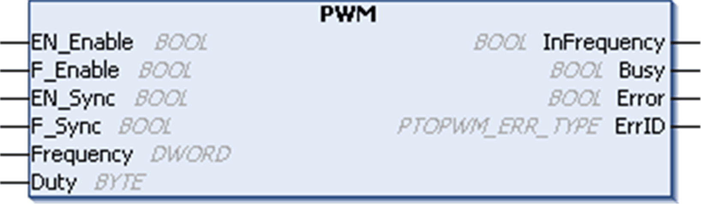

# Function Blocks

Function Blocks

Overview

The Pulse Width Modulation function block commands a pulse width modulated signal output at the specified frequency and duty cycle.

Graphical Representation

IL and ST Representation

To see the general representation in IL or ST language, refer to the chapter [Function and Function Block Representation](../Function_and_Function_Block_Representation/Function_and_Function_Block_Representation-1.htm#XREF_D_SE_0002384_1).

Input Variables

This table describes the input variables:

| Inputs | Type | Comment |
| --- | --- | --- |
| EN\_Enable | BOOL | TRUE = authorizes the PWM enable via the IN\_Enable input (if configured). |
| F\_Enable | BOOL | TRUE = forces the Enable function. |
| EN\_SYNC | BOOL | TRUE = authorizes the restart via the IN\_Sync input of the internal timer relative to the time base (if configured). |
| F\_SYNC | BOOL | On rising edge, forces a restart of the internal timer relative to the time base. |
| Frequency | DWORD | Frequency of the PWM output signal (range: min 100 (10 Hz)...max 650,000(65 kHz)). |
| Duty | BYTE | Duty cycle of the Pulse Width Modulation output signal in % (range: min 0...max 100). |

Output Variables

This table describes the output variables:

| Outputs | Type | Comment |
| --- | --- | --- |
| InFrequency | BOOL | TRUE = the Pulse Width Modulation signal is currently being output at the specified frequency and duty cycle. |
| Busy | BOOL | Busy is used to indicate that a command change is in progress: the frequency is changed.  Set to TRUE when the Enable command is set and the Frequency Generator signal is not output at the specified Frequency.  Reset to FALSE when InFrequency or Error is set, or when the Enable command is reset.  When a command change execution is immediate, Busy remains FALSE. |
| Error | BOOL | TRUE = indicates that an error was detected. |
| ErrID | [PTOPWM\_ERR\_TYPE](../MSD_M2xx_PTO_PWM_Library_CHAP_DATA/MSD_M2xx_PTO_PWM_Library_CHAP_DATA-2.htm#XREF_D_RU_0005008_1) | When Error is set: type of the detected error. |

EIO0000001518.05

© 2016 Schneider Electric. All rights reserved.