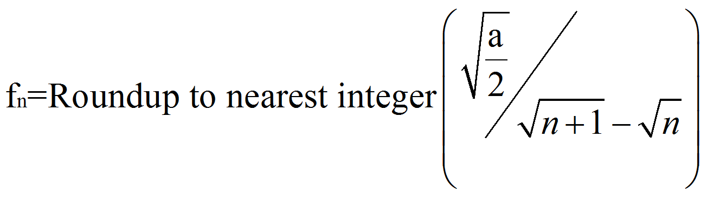
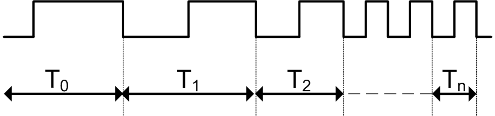
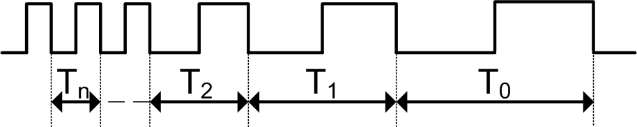
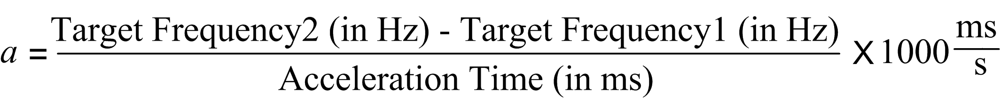

# Acceleration and Deceleration Pulses Calculation

Acceleration and Deceleration Pulses Calculation

Overview Pulses Calculation

The HMISCU calculates the time between pulses during acceleration and deceleration in the cases of:

oPTOMoveVelocity

oPTOMoveRelative

oPTOStop

oDec. Fast Stop

PTOMoveRelative: Acceleration Pulses Calculation

To calculate the period Tn (in seconds) between pulses during acceleration, the frequency fn is rounded up to the nearest integer for that pulse period is calculated:

a acceleration rate in Hz/s

This diagram depicts when Frequency Start = 0 Hz:

n is a positive integer representing the nth pulse period from the start of the acceleration phase.

PTOMoveRelative: Deceleration Pulses Calculation

To calculate the period Tn (in seconds) between pulses during deceleration, the frequency fn is rounded up to the nearest integer for that pulse period is calculated:

d deceleration rate in Hz/s

This diagram depicts when Frequency Start = 0 Hz:

n is a positive integer representing the nth pulse period from the end of the deceleration phase.

PTOMoveRelative: Determining Acceleration Rate (a) and Deceleration Rate (d)

If the units of Acc./Dec. Unit is set to ms, the acceleration rate in Hz/s is:

If the units of Acc./Dec. Unit are set to ms, the deceleration rate in Hz/s is:

The Target Frequency is value from the Velocity input pin from PTOMoveRelative function block.

The acceleration/deceleration time is the Acceleration/Deceleration input pins from the PTOMoveRelative function block.

If the units of Acc./Dec. Unit is set to Hz/ms, the acceleration/deceleration rate are that of the Acceleration/Deceleration pins on the PTOMoveRelative function block.

PTOMoveVelocity: Acceleration and Deceleration Pulses Calculation

If the units of Acc./Dec. Unit is set to ms, the acceleration rate from a motionless axis (current frequency = 0 Hz) in Hz/s is:

When a new motion command is issued when the axis is currently in motion from a previous motion command:

oif the new velocity is greater than the previous velocity and if the units of Acc./Dec. Unit is set to ms, the acceleration rate from an axis currently in motion from a previous motion command to a in Hz/s is:

oif the new velocity is less than the previous velocity and if the units of Acc./Dec. Unit is set to ms, the deceleration rate from an axis currently in motion from a previous motion command in Hz/s is:

Where:

Target Frequency is value from the Velocity input pin from PTOMoveVelocity function block for a motion command that accelerates from a motionless axis (0 Hz).

Target Frequency1 is the current constant velocity of the axis from a previous motion command.

Target Frequency2 is the velocity target for the next motion command.

The acceleration/deceleration time is the Acceleration/Deceleration input pins from the PTOMoveVelocity function block.

If the units of Acc./Dec. Unit is set to Hz/ms, the acceleration/deceleration rate are that of the Acceleration/Deceleration pins on the PTOMoveVelocity function block.

PTOStop: Determining Deceleration Rate (d)

If the units of Acc./Dec. Unit are set to ms, the deceleration rate in Hz/s is:

The Target Frequency is from the Velocity input pin from PTOMoveRelative or PTOMoveVe­locity function block.

The deceleration time is the Deceleration input pin from the PTOStop function block.

If the units of Acc./Dec. Unit are set to Hz/ms, the deceleration rate is that of the Deceleration pin on the PTOStop function block.

Dec. Fast Stop

If the units of Acc./Dec. Unit are set to ms, the deceleration rate in Hz/s is:

Maximum Frequency and Dec. Fast Stop are set in the PTO configuration user interface (or with PTOSetParam during program operation).

If the units of acceleration/deceleration are set to Hz/ms, the deceleration rate is that of the Dec. Fast Stop rate set in the PTO configuration user interface.

All Cases

NOTE: The minimum acceleration or deceleration rate is 1000 Hz/s (1 Hz/ms). If the calculated acceleration or deceleration rate is less than 1000 Hz/s, the rate used will be 1000 Hz/s (this case is only possible when Frequency Start or Frequency Stop is predefined to be > 0 Hz).

EIO0000001518.05

© 2016 Schneider Electric. All rights reserved.