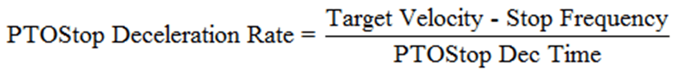
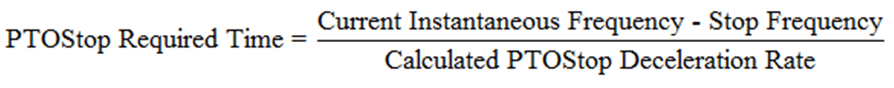
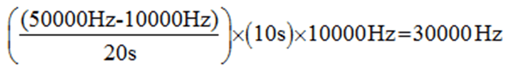
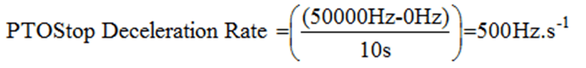
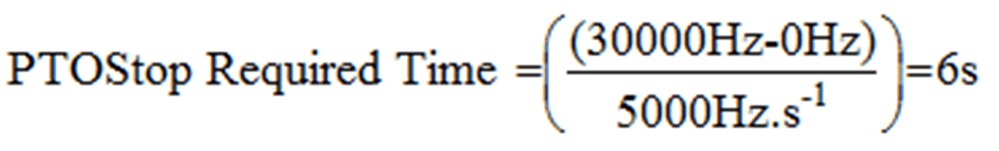

# PTOStop Implementation with PTOMoveVelocity and PTOMoveRelative

PTOStop Implementation with PTOMoveVelocity and PTOMoveRelative

Introduction

PTOStop does not follow the specified deceleration time when triggered during an acceleration/deceleration phase of PTOMoveVelocity or PTOMoveRelative. When executing PTOStop during acceleration or deceleration phase of PTOMoveVelocity or PTOMoveRelative, the time required for a complete stop will not adhere to the time specified in the PTOStop function block Deceleration input pin.

Instead, the HMI SCU applies the methods described below for PTOStop during acceleration and deceleration.

PTOStop can be triggered in a total possible 4 cases:

1.Constant Frequency Output when PTOMoveVelocity or PTOMoveRelative has reached its Target Velocity.

2.Acceleration phase of PTOMoveVelocity to a new higher Target Velocity.

3.Deceleration phase of PTOMoveVelocity to a new lower Target Velocity.

4.Acceleration phase or deceleration phase of PTOMoveRelative.

PTOStop Calculation

In all cases, the deceleration rate of PTOStop is recalculated using the LAST Target Frequency of PTOMoveVelocity or PTOMoveRelative:

In all cases, the time required for PTOStop to complete a stop is instantaneous:

Case 1: PTOStop Command Is Issued During Constant Frequency Output When PTOMoveVelocity or PTOMoveRelative Has Reached Its Target Velocity

PTOStop will respect the deceleration time set in the function block. In this case, the Current Instantaneous Frequency  is the same as the Target Frequency. Therefore the deceleration time set in the PTOStop function block's Deceleration input pin will be respected.

Case 2: PTOStop Command Is Issued During Acceleration Phase of PTOMoveVelocity to a New Higher Target Velocity

In this case, the Target Velocity is greater than the frequency being output at all times during acceleration. That means that the newly calculated rate of deceleration for PTOStop will result in the axis reaching 0 Hz within a shorter time than specified in the PTOStop Deceleration input pin.

Case 2: Example

The following actions take place in this sequence:

oStop Frequency is configured to be 0 Hz.

oPTOMoveVelocity is executed for the first time with the Target Velocity = 10 kHz.

oThe PTO output reaches 10 kHz.

oA new PTOMoveVelocity command is issued to accelerate to 50 kHz in 20 seconds.

o10 seconds elapse. At this instance in time, the instantaneous output frequency is:

oPTOStop command is issued with 10000 ms set in the Deceleration input pin. The deceleration rate of PTOStop will be calculated to be:

Therefore, the time the PTOStop command is issued to the time the PTO output is stopped requires:

NOTE: You will notice that 6 seconds is a shorter time than set in the original PTOStop command (10 s).

Case 3: Deceleration Phase of PTOMoveVelocity to a New Lower Target Velocity

In this case, the Target Velocity is greater than the frequency being output at all times during acceleration. That means that the newly calculated rate of Deceleration for PTOStop will result in the axis reaching 0 Hz within a greater time than specified in the PTOStop Deceleration input pin.

Case 3: Example

The following actions take place in this sequence:

oStop Frequency is configured to be 0 Hz.

oPTOMoveVelocity is executed for the first time with the Target Velocity = 50 kHz.

oThe PTO output reaches 50 kHz.

oA new PTOMoveVelocity command is issued to decelerate to 100 kHz in 20 seconds.

o10 seconds elapse. At this instance in time, the instantaneous output frequency is:

oPTOStop command is issued with 10000 ms set in the Deceleration input pin. The deceleration rate of PTOStop will be calculated to be:

Therefore, the time the PTOStop command is issued to the time the PTO output is stopped requires:

NOTE: You will notice that 30 seconds is a longer time than set in the original PTOStop command (10 s).

Case 4: Acceleration Phase or Deceleration Phase of PTOMoveRelative

In PTOMoveRelative, both the acceleration phase and deceleration phase are only associated with a single Target velocity, the PTOStop required time will always be calculated to be smaller than the value input into PTOStop Deceleration time.

The calculation would be exactly like in case 2.

NOTE: If the newly calculated deceleration rate for PTOStop is lower than 1000 Hz/s, it will just use 1000 Hz/s as the rate. This is true for PTOMoveVelocity and PTOMoveRelative.

NOTE: Unlike PTOMoveVelocity, PTOMoveRelative always uses the Target velocity to calculate the PTOStop deceleration rate when the units used is milliseconds. Whether PTOMoveRelative is in the acceleration phase, deceleration phase, or constant frequency, it will always use the same calculated rate for PTOStop deceleration.

NOTE: If the units setting for PTO is configured to be Hz/ms (rate), PTOStop for all above cases will just follow the rate value set in the Deceleration input with no recalculation.

Information

For more information on all the features added in this release, see the updated Online Help Documentation in SoMachine.

EIO0000001518.05

© 2016 Schneider Electric. All rights reserved.