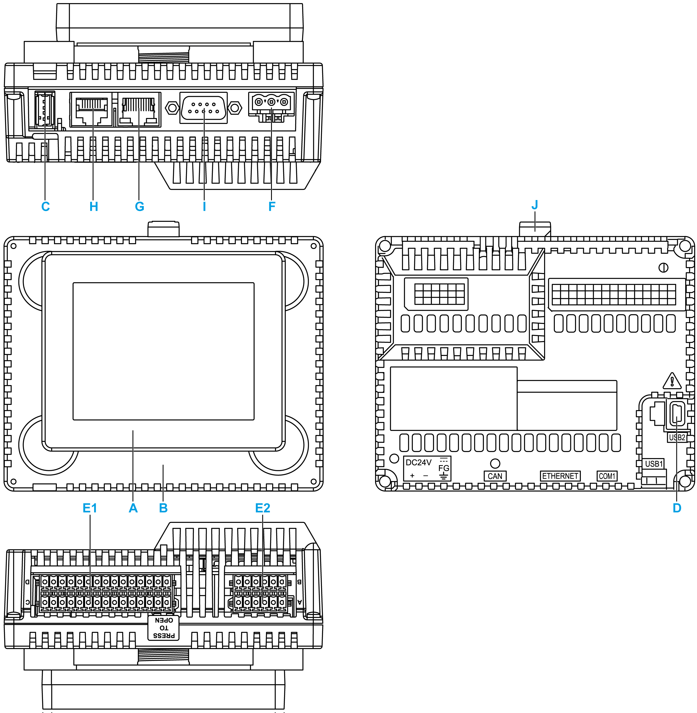

# HMISCU Parts Identification

HMISCU Parts Identification

| Part | Description |
| --- | --- |
| A | [Display module](../Display_Modules/Display_Modules.htm#XREF_D_SE_0024505_1) |
| B | [Rear module](../HMI_SCU_Controller_Panel/HMI_SCU_Controller_Panel.htm#XREF_D_SE_0024497_1) |
| C | [USB (type A) port (USB1)](../HMI_SCU_Logic_Controller_Installation/HMI_SCU_Logic_Controller_Installation-14.htm#XREF_D_SE_0024517_1) |
| D | USB (type mini B) port (USB2) |
| E1 | [I/O terminal block 1](../HMI_SCU6A5_Controller_Panel_for_Machine/HMI_SCU6A5_Controller_Panel_for_Machine-2.htm#XREF_D_SE_0024612_4) |
| E2 | [I/O terminal block 2](../HMI_SCU6A5_Controller_Panel_for_Machine/HMI_SCU6A5_Controller_Panel_for_Machine-2.htm#XREF_D_SE_0024612_4) |
| F | [DC power supply connector](../HMI_SCU_Logic_Controller_Installation/HMI_SCU_Logic_Controller_Installation-11.htm#XREF_D_SE_0024597_1) |
| G | [Ethernet connector](../HMI_SCU-Communication_Services/HMI_SCU-Communication_Services-2.htm#XREF_D_SE_0024534_1) |
| H | [Serial link (RS-232C/485)](../HMI_SCU-Communication_Services/HMI_SCU-Communication_Services-4.htm#XREF_D_SE_0024927_1) |
| I | CANopen connector |
| J | Yellow button lock |