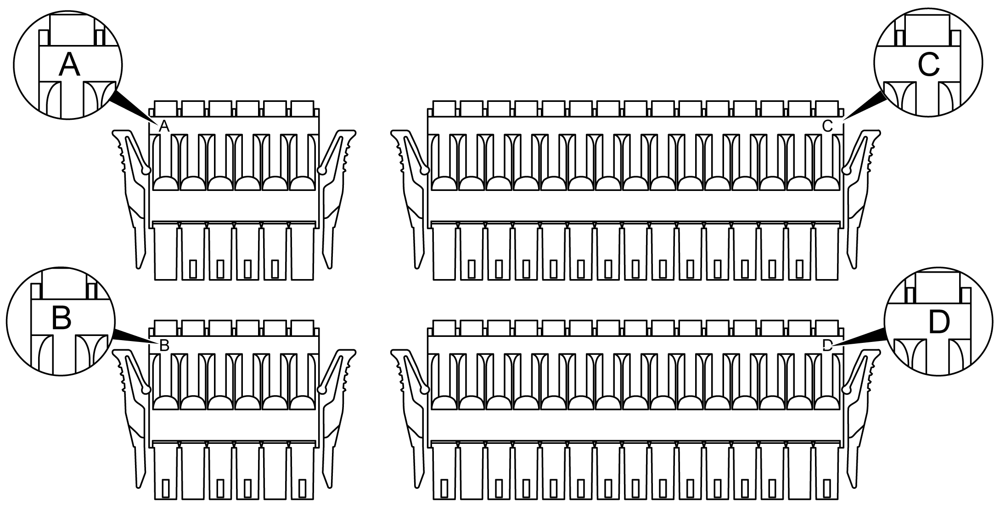

# Terminal Block

Terminal Block

Plugging a terminal block into the incorrect rear module can cause an electric shock or unintended operation of the application and/or can damage the rear module.

|  |
| --- |
| DangerElectrical_Color.gifDanger_Color.gifDANGER |
| ELECTRIC SHOCK OR UNINTENDED EQUIPMENT OPERATION |
| Connect the terminal blocks to their designated location. |
| Failure to follow these instructions will result in death or serious injury. |

Avoid temperature changes on the thermocouple’s connection terminal. Temperature measurements may not be accurate due to temperature changes in the cold junction.

NOTE: When installing the terminal blocks to the rear module, please keep the display module unmounted.

NOTE: To help prevent a terminal block from being inserted incorrectly, clearly and uniquely code and label each terminal block and rear module.

The figure shows the labels on each terminal block:

NOTE: Terminal blocks A, B, C, and D can only use the respective connectors A, B, C, and D.