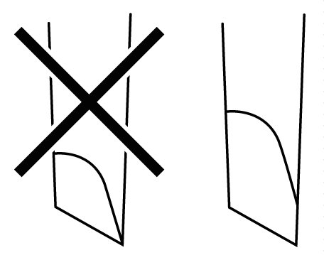

# Screwdriver Required to Wire Terminal Blocks

Screwdriver Required to Wire Terminal Blocks

Recommended type: 1891348-1 (Tyco Electronics AMP)

If another manufacturer is used, be sure the part has the following dimensions:

opoint depth: 1.5 mm (0.06 in.)

opoint height: 2.4 mm (0.09 in.)

Point shape must be DIN5264A and meet standard DN EN60900.

Also, the screwdriver tip must be flat, as indicated, to access the narrow hole of the terminal block:

The terminal blocks are a spring clamp type.